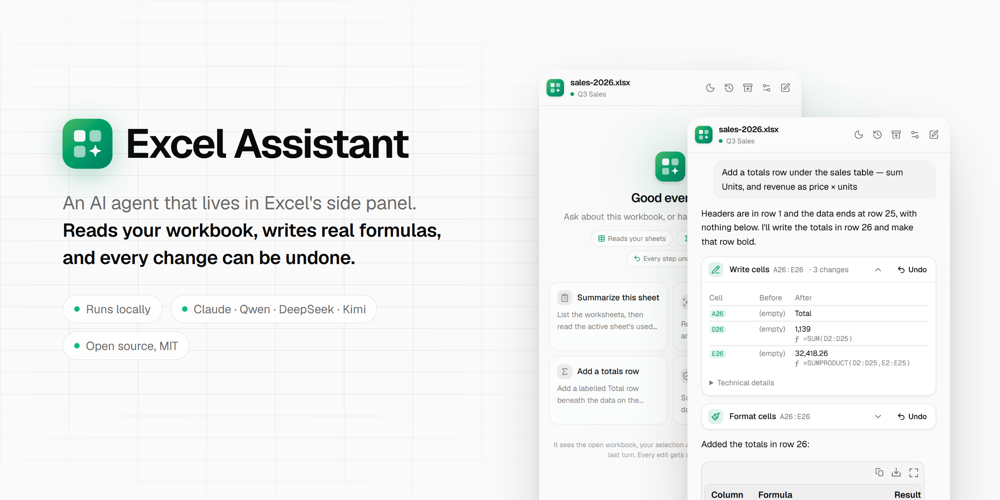
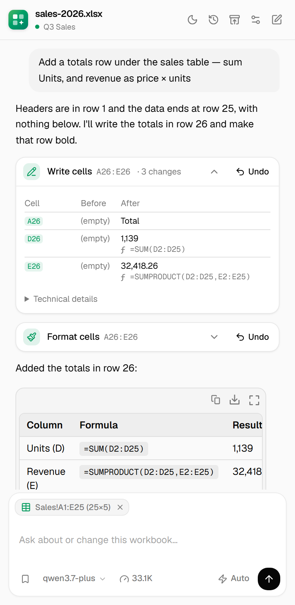
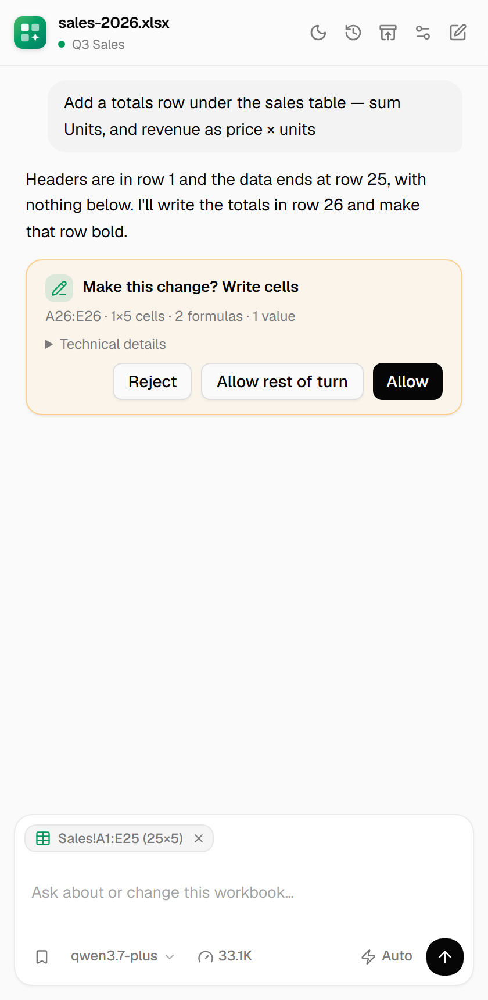
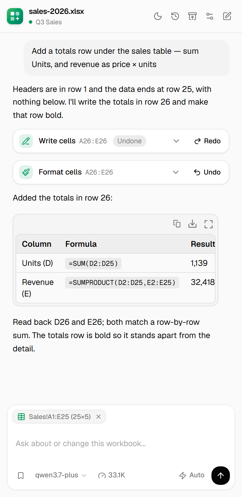
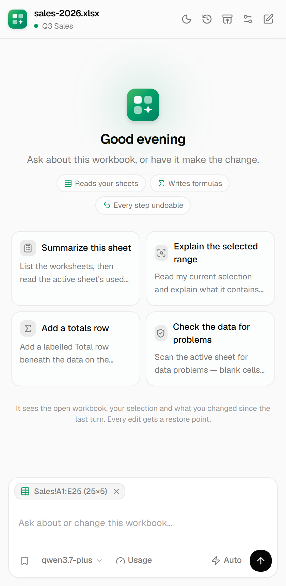
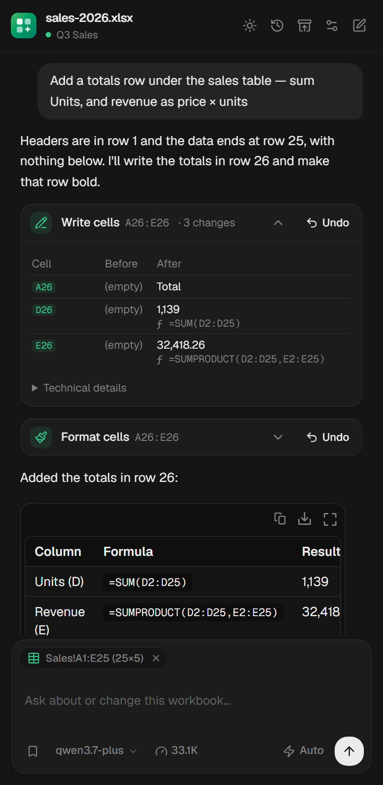
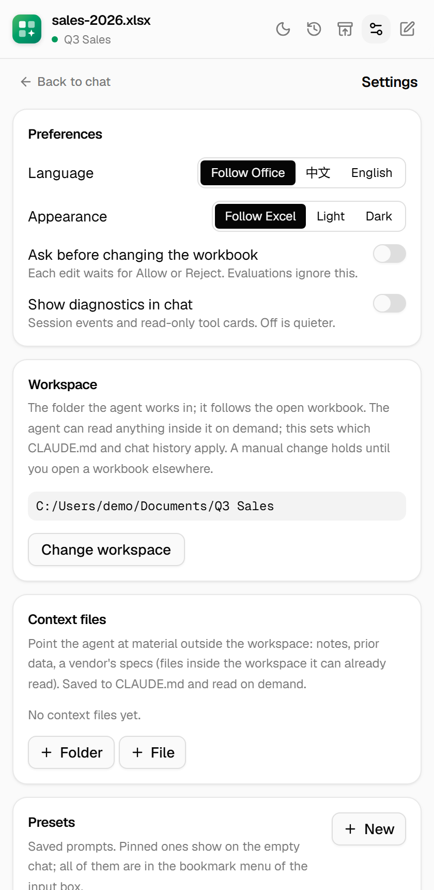
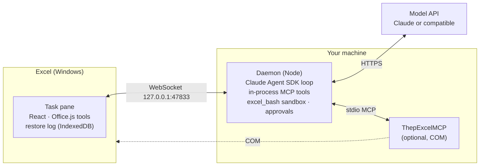

<div align="center">

<picture>
  <source media="(prefers-color-scheme: dark)" srcset="docs/images/banner-en-dark.png">
  
</picture>

**English** · [简体中文](README.zh-CN.md)

[](LICENSE)


</div>

Excel Assistant is an AI agent that sits in Excel's side panel. Ask it about the workbook you have open, or tell it what to change. It reads the sheets, writes real formulas instead of pasted numbers, shows you every cell it touched, and keeps a restore point so each change can be undone with one click.

It runs on your own machine and works with the model you choose: an Anthropic API key, or any Anthropic-compatible API such as Qwen, DeepSeek, Kimi, GLM or MiniMax.

<table>
  <tr>
    <td width="33%" align="center"></td>
    <td width="33%" align="center"></td>
    <td width="33%" align="center"></td>
  </tr>
  <tr>
    <td align="center"><b>See every cell it changed</b><br><sub>Before and after, with the formula and its result</sub></td>
    <td align="center"><b>Approve before it writes</b><br><sub>Optional; one switch in the input bar</sub></td>
    <td align="center"><b>Undo and redo in place</b><br><sub>On the card of the change itself</sub></td>
  </tr>
</table>

## Highlights

**It looks before it acts.** Every message carries an overview of the workbook (sheets, headers, tables, named ranges), your current selection with the rows around it, and the cells you changed since the last turn. Large sheets are read and searched page by page, never loaded whole.

**Real work, not text in a chat.** Values, formulas, formatting, sorting, filters, tables, charts, rows, columns and sheets, all through Office.js. It can also explain a formula and trace what feeds a cell or what breaks if you change it.

**Every change is accountable.** Each write reports whether Excel committed it, which range it touched (click to select it), how it was verified, and a cell-by-cell Before/After table. Overwriting cells that already hold data needs an explicit flag.

**Every change can be undone.** A restore point is taken before each write, covering values, formulas, formatting, sorting, clearing, rows and columns, sheets, tables, filters, hidden rows and columns, frozen panes, comments and chart creation. Undo sits on the change's own card, turns into Redo, and can go back and forth.

**Beyond what Office.js can reach.** A sandboxed shell (Python standard library, awk, jq, sqlite3) crunches data too large for the chat, and moves it between the sheet and the shell without passing through the model. Windows COM tools reach Power Query, PivotTable layouts, the Data Model and DAX, conditional formatting and data validation. Anthropic's financial-analysis skills add DCF, LBO, three-statement, comps and model audits.

**Made for daily use.** One conversation history per workbook, with portable read-only exports. A restore-point browser. Follow-ups you can queue while it works. Token and cost display. Presets. Chinese and English UI. Light and dark themes that follow Excel.

<table>
  <tr>
    <td width="33%" align="center"></td>
    <td width="33%" align="center"></td>
    <td width="33%" align="center"></td>
  </tr>
  <tr>
    <td align="center"><sub>Start from a suggestion or your own words</sub></td>
    <td align="center"><sub>Follows Excel's theme, or pick one</sub></td>
    <td align="center"><sub>Language, appearance, workspace, model</sub></td>
  </tr>
</table>

## Quick start

**You need:** Windows 10 or 11 with desktop Excel (Microsoft 365, or Excel 2021 or later), Node.js 20.18.1 or later, and an API key for Anthropic or an Anthropic-compatible provider.

```bash
git clone https://github.com/ALbum3270/excel-assistant.git
cd excel-assistant
npm install
npm start
```

1. A tray icon appears. On first launch it offers to install the add-in into Excel; click **Install**. It registers through the `WEF\Developer` registry key, so no admin rights or network share are needed.
2. Quit and reopen Excel, then open **Excel Assistant** from **Home → Add-ins**.
3. Open a saved workbook and ask, for example: _"Add a total row under the sales table"_ or _"Why is D14 showing #N/A?"_

`npm start` builds the pane first. To watch the daemon's log in a terminal, run `npm run dev` instead.

## Choose a model

Enter the provider's Anthropic-compatible base URL, API key and model IDs under **Settings → Model connection** (saving restarts the local daemon), or copy `.env.example` to `.env`, which only this project reads. For Anthropic itself, `ANTHROPIC_API_KEY` is enough. Example for Qwen:

```bash
ANTHROPIC_BASE_URL=https://dashscope.aliyuncs.com/apps/anthropic
ANTHROPIC_AUTH_TOKEN=sk-your-key
ANTHROPIC_DEFAULT_HAIKU_MODEL=qwen3.7-flash
ANTHROPIC_DEFAULT_SONNET_MODEL=qwen3.7-plus
ANTHROPIC_DEFAULT_OPUS_MODEL=qwen3.7-max
```

The model picker in the input bar switches between these three tiers.

<details>
<summary><b>Optional: COM tools, finance skills and built-in tools</b></summary>

Copy `agent.config.example.json` to `agent.config.json` to turn on:

- **COM tools** (`mcpServers`): point it at your [ThepExcelMCP](https://github.com/ThepExcel/ThepExcelMCP) checkout (needs [uv](https://docs.astral.sh/uv/)).
- **Finance skills** (`plugins`, `skills`): point it at [financial-services-plugins](https://github.com/anthropics/financial-services-plugins).
- **Built-in tools** (`builtinTools`): the default is read-only file access plus web search.

The agent does not inherit the MCP servers from your global `~/.claude.json` (`inheritUserMcpServers: false`), which keeps its context small and predictable.

</details>

## How it works



The tray app (`app/`) starts the daemon and registers the add-in with Excel. The daemon serves the task pane and Office.js locally on port 47834. The pane runs every Excel tool itself through Office.js, so the workbook is only ever changed from inside Excel.

## Built from open source

Excel Assistant is assembled from projects that already do each part well; this repository is the glue between them, the fixes found along the way, and the tests and evaluation harness that check the result. Upstream code is copied at pinned commits by scripts in `scripts/`, with small patches that must each match exactly once.

| Part                                                             | Taken from                                                                                                                         | License          |
| ---------------------------------------------------------------- | ---------------------------------------------------------------------------------------------------------------------------------- | ---------------- |
| Daemon, WebSocket bridge, tray app, sideloading                  | [Draftspect](https://github.com/LeonardHope/Draftspect-Add-Ins-for-Word-and-Excel-Powered-by-Claude-Code)                          | MIT              |
| Chat components: conversation, messages, approvals, usage, input | [AI Elements](https://github.com/vercel/ai-elements) on [shadcn/ui](https://github.com/shadcn-ui/ui)                               | Apache-2.0 / MIT |
| Visual design: colors, shadows, greeting and input styling       | [Vercel chatbot template](https://github.com/vercel/ai-chatbot), [Geist](https://vercel.com/font) typeface                         | Apache-2.0 / OFL |
| Tool cards, Before/After tables, cell links, tool grouping       | [pi-for-excel](https://github.com/tmustier/pi-for-excel) (design), side-panel layout after [Cline](https://github.com/cline/cline) | MIT / Apache-2.0 |
| Excel Office.js API layer                                        | [office-agents](https://github.com/hewliyang/office-agents)                                                                        | MIT              |
| Workbook context, formula explain and trace, restore log         | [pi-for-excel](https://github.com/tmustier/pi-for-excel)                                                                           | MIT              |
| Task-solving protocol in the system prompt                       | [fabric-rlm](https://github.com/pawarbi/fabric-rlm-core)                                                                           | MIT              |
| Sandboxed shell                                                  | [just-bash](https://github.com/vercel-labs/just-bash)                                                                              | Apache-2.0       |
| COM tools for advanced Excel features                            | [ThepExcelMCP](https://github.com/ThepExcel/ThepExcelMCP)                                                                          | MIT              |
| Finance skills                                                   | [financial-services-plugins](https://github.com/anthropics/financial-services-plugins)                                             | Apache-2.0       |
| Agent loop                                                       | [Claude Agent SDK](https://www.npmjs.com/package/@anthropic-ai/claude-agent-sdk)                                                   | Anthropic terms  |

What this repository adds on top: overwrite protection and a commit receipt from every write; cancellation and ownership checks on tool calls; one-click undo and redo per change; approve-before-apply built on the SDK's permission hook; a workbook write coordinator that refuses to act on a stale view of the sheet; fixes to upstream code found by testing in real Excel; and an evaluation harness. Full credits are in [NOTICE.md](NOTICE.md); a comparison with other open-source Excel agents is in [docs/open-source-comparison.md](docs/open-source-comparison.md).

## Safety and privacy

- The workbook is changed only through Office.js tools inside Excel. The agent cannot write Office files on disk, and VBA and Python in Excel are disabled.
- Overwriting cells that already hold data needs an explicit flag, and every write reports whether Excel committed it.
- Restore points stay local, in the task pane's storage. Before each COM write, the workbook file is also copied to `~/.claude/office-addins/com-backups/`.
- The conversation, including the cell contents the model reads, goes to the model provider you configure. Web search and fetch, when the agent uses them, go to the web.

## Evaluation

`evals/run_spreadsheetbench.py` runs [SpreadsheetBench](https://github.com/RUCKBReasoning/SpreadsheetBench) Verified-400 tasks in live Excel and grades them with [Harbor](https://github.com/harbor-framework/harbor)'s version of the benchmark's grader, which keeps its cell comparison rules and fixes the places where the original crashes on an answer position (whole-column ranges, commas in sheet names). On all 400 tasks it gives the original's verdict wherever the original runs. The task prompt is the official one, plus one line adapting it to a live workbook. The harness pins each run's configuration, records execution and grading failures separately from answer mismatches, and counts edits outside the answer range. These outcome labels do not establish the root cause of a failed task.

| Run                                                  | Model         | Tasks | Passed |
| ---------------------------------------------------- | ------------- | ----: | -----: |
| 2026-09-26, stratified random sample (seed 20260925) | qwen3.7-flash |   100 | **62** |

Cell-level tasks 42/69, sheet-level 20/31. With 100 tasks the 95% confidence interval is about 52%–71%, so small differences between runs are noise. The benchmark grades only the answer range; three of the passing tasks also changed cells outside it. This is a local run, not an official leaderboard submission.

To reproduce: `uv run --project evals python evals/run_spreadsheetbench.py --dataset <spreadsheetbench_verified_400> --run <name> --model haiku --sample 100 --seed 20260925` (the `haiku` tier is mapped to qwen3.7-flash in `.env`).

For reference, published results from two comparable agents:

| System                                                                                                                                                                     | Model                            | How it works                                     | Tasks                            | Score |
| -------------------------------------------------------------------------------------------------------------------------------------------------------------------------- | -------------------------------- | ------------------------------------------------ | -------------------------------- | ----: |
| Excel Assistant (this run)                                                                                                                                                 | qwen3.7-flash                    | In live Excel, through Office.js tools           | 100-task sample of Verified-400  |   62% |
| [Claude Code 2.1.80](https://github.com/harbor-framework/harbor/blob/main/adapters/spreadsheetbench-verified/parity_experiment.json)                                       | Claude Haiku 4.5                 | Edits the .xlsx files with Python in a container | Verified-400, 3 runs             | 68.8% |
| [Microsoft Excel Agent Mode](https://www.microsoft.com/en-us/microsoft-365/blog/2025/09/29/vibe-working-introducing-agent-mode-and-office-agent-in-microsoft-365-copilot/) | Copilot's OpenAI reasoning model | In Excel, through Excel's JavaScript APIs        | Full SpreadsheetBench, 912 tasks | 57.2% |

## Development

```bash
npm test                      # Node tests
npm run build:pane            # bundle the task pane (start and dev run this first)
npm run vendor:ai-elements    # re-copy the AI Elements components and theme
npm run vendor:office-agents  # rebuild the office-agents bundle
npm run vendor:pi-context     # rebuild the pi-for-excel bundles
python -X utf8 evals/run_spreadsheetbench.py --dataset <path/to/spreadsheetbench_verified_400> --run <name> --model haiku --ids <task ids>
```

- The pane lives in `taskpane/app/`: `core/` holds the DOM-free logic (bridge, tool execution, state), `view/` the React UI, and `vendor/` the copied components.
- Vendor scripts need the upstream checkouts at their pinned commits with clean working trees.
- After changing pane code, run `npm run build:pane` and reload the pane in Excel.

## Limitations

- Built and tested on Windows only; the COM tools are Windows-only.
- Restore is incomplete for chart deletion and data-source changes, PivotTables and duplicated sheets. COM writes get a file copy of the **last saved** workbook instead of a cell-level restore point (ten kept per workbook; `EXCEL_COM_BACKUP=off` turns it off).
- After rows, columns or a sheet are deleted and restored, formulas on other sheets that pointed at them stay `#REF!`.

## License

MIT; see [LICENSE](LICENSE). Third-party components keep their own licenses; see [NOTICE.md](NOTICE.md).
