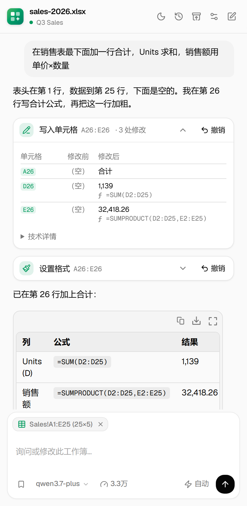
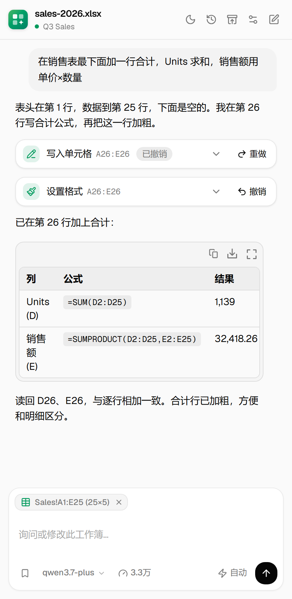
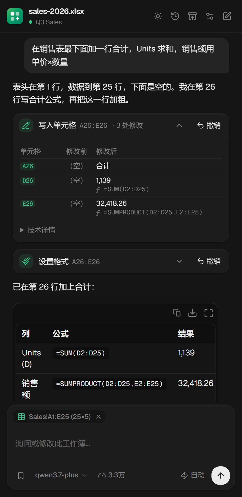
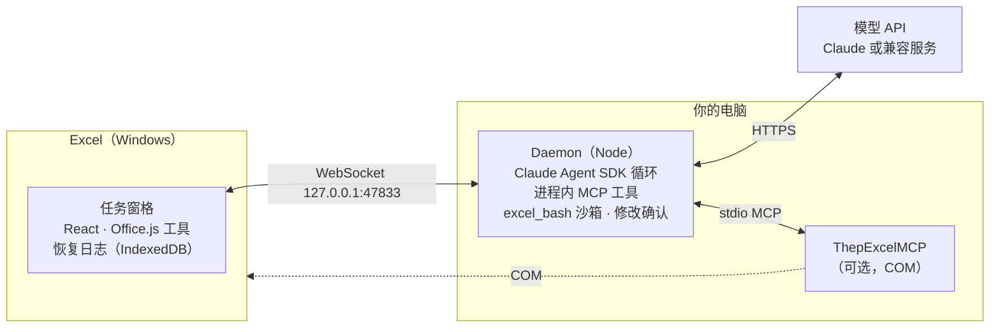

<div align="center">

<picture>
  <source media="(prefers-color-scheme: dark)" srcset="docs/images/banner-zh-dark.png">
  
</picture>

[English](README.md) · **简体中文**

[](LICENSE)


</div>

Excel 助手是一个住在 Excel 侧栏里的 AI 助手。你可以问它当前打开的工作簿，也可以直接让它改。它会先读表，写的是真正的公式而不是粘贴的数字，把改过的每个单元格都列给你看，并在每次修改前留恢复点，一键就能撤销。

它运行在你自己的电脑上，模型由你选择：Anthropic API key，或任何 Anthropic 兼容接口，例如通义千问、DeepSeek、Kimi、智谱 GLM、MiniMax。

<table>
  <tr>
    <td width="33%" align="center"></td>
    <td width="33%" align="center"></td>
    <td width="33%" align="center"></td>
  </tr>
  <tr>
    <td align="center"><b>改了哪些格，一目了然</b><br><sub>修改前、修改后，公式和结果都在</sub></td>
    <td align="center"><b>写入前先问你</b><br><sub>可选，输入栏里一个开关</sub></td>
    <td align="center"><b>原地撤销、重做</b><br><sub>就在那次修改的卡片上</sub></td>
  </tr>
</table>

## 亮点

**先看清楚再动手。** 每条消息都会带上工作簿概况（工作表、表头、表格、名称区域）、你当前的选区及其上下几行，以及你在上一轮之后改过的单元格。大表按页读取和搜索，不会整张加载。

**真的干活，不只是聊天。** 值、公式、格式、排序、筛选、表格、图表、行列、工作表，全部通过 Office.js 完成。它还能解释公式，追踪一个单元格依赖谁、改了会影响谁。

**每次修改都有交代。** 每次写入都会报告 Excel 是否已提交、改了哪个区域（点击即可在 Excel 里选中）、如何核对，并附上逐格的修改前 / 修改后对照表。覆盖已有数据的单元格需要明确授权。

**每次修改都能撤销。** 每次写入前都会留恢复点，覆盖值、公式、格式、排序、清除、行列、工作表、表格、筛选、隐藏行列、冻结窗格、批注和图表创建。撤销按钮就在那次修改的卡片上，撤销后变成重做，可以来回切换。

**做到 Office.js 做不到的事。** 沙箱 shell（Python 标准库、awk、jq、sqlite3）处理聊天装不下的大数据，数据在工作表和沙箱之间直接传递，不经过模型。通过 Windows COM 操作 Power Query、透视表布局、数据模型和 DAX、条件格式、数据验证。接入 Anthropic 的财务分析技能：DCF、LBO、三表模型、可比公司分析和模型审计。

**为日常使用而做。** 每个工作簿有独立的对话历史，可导出为只读存档；恢复点列表；助手工作时可以继续排队下一条；显示 token 用量和费用；快捷指令；中英文界面；浅色和深色主题跟随 Excel。

<table>
  <tr>
    <td width="33%" align="center"></td>
    <td width="33%" align="center"></td>
    <td width="33%" align="center"></td>
  </tr>
  <tr>
    <td align="center"><sub>从建议开始，或者直接说</sub></td>
    <td align="center"><sub>跟随 Excel 主题，也可以自己选</sub></td>
    <td align="center"><sub>语言、外观、工作区、模型</sub></td>
  </tr>
</table>

## 快速开始

**需要：** Windows 10 或 11 与桌面版 Excel（Microsoft 365，或 Excel 2021 及以上）、Node.js 20.18.1 及以上，以及 Anthropic 或某个 Anthropic 兼容服务的 API key。

```bash
git clone https://github.com/ALbum3270/excel-assistant.git
cd excel-assistant
npm install
npm start
```

1. 托盘里会出现图标。首次启动时它会提示把加载项安装到 Excel，点 **Install**。加载项通过 `WEF\Developer` 注册表项注册，不需要管理员权限，也不需要网络共享。
2. 退出并重新打开 Excel，在 **开始 → 加载项** 里打开 **Excel Assistant**。
3. 打开一个已保存的工作簿，试着问：_"在销售表下面加一行合计"_，或 _"D14 为什么显示 #N/A？"_

`npm start` 会先打包任务窗格。想在终端里看 daemon 日志，改用 `npm run dev`。

## 选择模型

在 **设置 → 模型连接** 里填写服务商的 Anthropic 兼容接口地址、API key 和各档模型 ID（保存后本地 daemon 会重启）；或者把 `.env.example` 复制为 `.env`（只有本项目读取它）。直接用 Anthropic 的话，只填 `ANTHROPIC_API_KEY` 即可。以通义千问为例：

```bash
ANTHROPIC_BASE_URL=https://dashscope.aliyuncs.com/apps/anthropic
ANTHROPIC_AUTH_TOKEN=sk-your-key
ANTHROPIC_DEFAULT_HAIKU_MODEL=qwen3.7-flash
ANTHROPIC_DEFAULT_SONNET_MODEL=qwen3.7-plus
ANTHROPIC_DEFAULT_OPUS_MODEL=qwen3.7-max
```

输入栏里的模型菜单在这三档之间切换。

<details>
<summary><b>可选：COM 工具、财务技能和内置工具</b></summary>

把 `agent.config.example.json` 复制为 `agent.config.json`，可以打开：

- **COM 工具**（`mcpServers`）：指向你的 [ThepExcelMCP](https://github.com/ThepExcel/ThepExcelMCP) 目录（需要 [uv](https://docs.astral.sh/uv/)）。
- **财务技能**（`plugins`、`skills`）：指向 [financial-services-plugins](https://github.com/anthropics/financial-services-plugins)。
- **内置工具**（`builtinTools`）：默认是只读文件访问加网络搜索。

助手默认不继承你全局 `~/.claude.json` 里的 MCP 服务器（`inheritUserMcpServers: false`），上下文更小、行为更可预期。

</details>

## 工作原理



托盘程序（`app/`）负责启动 daemon 并把加载项注册到 Excel。daemon 在本地 47834 端口提供任务窗格和 Office.js。所有 Excel 工具都由任务窗格通过 Office.js 执行，工作簿只会在 Excel 内部被修改。

## 由开源项目组合而成

Excel 助手由各部分做得最好的现有项目组合而成；本仓库做的是它们之间的衔接、沿途发现问题的修复，以及检验结果的测试和评测。上游代码由 `scripts/` 下的脚本按锁定的 commit 复制进来，附带的小补丁每处都必须恰好匹配一次。

| 部分                                         | 来源                                                                                                                   | 许可证           |
| -------------------------------------------- | ---------------------------------------------------------------------------------------------------------------------- | ---------------- |
| Daemon、WebSocket 桥、托盘程序、加载项注册   | [Draftspect](https://github.com/LeonardHope/Draftspect-Add-Ins-for-Word-and-Excel-Powered-by-Claude-Code)              | MIT              |
| 聊天组件：对话、消息、确认、用量、输入框     | [AI Elements](https://github.com/vercel/ai-elements)，基于 [shadcn/ui](https://github.com/shadcn-ui/ui)                | Apache-2.0 / MIT |
| 视觉设计：配色、阴影、欢迎页和输入框样式     | [Vercel chatbot 模板](https://github.com/vercel/ai-chatbot)，[Geist](https://vercel.com/font) 字体                     | Apache-2.0 / OFL |
| 工具卡片、修改前后对照、单元格链接、工具分组 | [pi-for-excel](https://github.com/tmustier/pi-for-excel)（设计），侧栏布局参考 [Cline](https://github.com/cline/cline) | MIT / Apache-2.0 |
| Excel Office.js API 层                       | [office-agents](https://github.com/hewliyang/office-agents)                                                            | MIT              |
| 工作簿上下文、公式解释与追踪、恢复日志       | [pi-for-excel](https://github.com/tmustier/pi-for-excel)                                                               | MIT              |
| 系统提示里的解题规程                         | [fabric-rlm](https://github.com/pawarbi/fabric-rlm-core)                                                               | MIT              |
| 计算沙箱                                     | [just-bash](https://github.com/vercel-labs/just-bash)                                                                  | Apache-2.0       |
| 高级 Excel 功能的 COM 工具                   | [ThepExcelMCP](https://github.com/ThepExcel/ThepExcelMCP)                                                              | MIT              |
| 财务技能                                     | [financial-services-plugins](https://github.com/anthropics/financial-services-plugins)                                 | Apache-2.0       |
| 智能体循环                                   | [Claude Agent SDK](https://www.npmjs.com/package/@anthropic-ai/claude-agent-sdk)                                       | Anthropic 条款   |

本仓库在此之上增加的：覆盖保护和每次写入的提交回执；工具调用的取消与归属检查；每次修改一键撤销、重做；基于 SDK 权限钩子的写入前确认；拒绝基于过时工作簿状态写入的写入协调器；在真实 Excel 中测出的上游问题修复；以及评测框架。完整致谢见 [NOTICE.md](NOTICE.md)；与其他开源 Excel 智能体的对比见 [docs/open-source-comparison.md](docs/open-source-comparison.md)。

## 安全与隐私

- 工作簿只通过 Excel 内部的 Office.js 工具修改。助手不能在磁盘上写 Office 文件，VBA 和 Excel 中的 Python 已禁用。
- 覆盖已有数据的单元格需要明确授权，每次写入都会报告 Excel 是否已提交。
- 恢复点保存在本地任务窗格的存储里。每次 COM 写入前，还会把工作簿文件复制到 `~/.claude/office-addins/com-backups/`。
- 对话内容（包括模型读到的单元格内容）会发送到你配置的模型服务商。助手使用网络搜索和网页读取时会访问网络。

## 评测

`evals/run_spreadsheetbench.py` 在真实 Excel 中运行 [SpreadsheetBench](https://github.com/RUCKBReasoning/SpreadsheetBench) Verified-400 题目，用 [Harbor](https://github.com/harbor-framework/harbor) 版本的基准判分器评分：保留原版的单元格比对规则，修正了原版在整列地址、表名含逗号等答案位置上崩溃的问题。在全部 400 题上，凡原版能运行的题，两者判定一致。题目提示词使用官方版本，只加一行说明改为操作打开着的工作簿。评测框架固定每次运行的配置，分别记录执行及判分异常、答案不符，并统计答案区域之外的改动；这些结果标签不等于已经查明失败根因。

| 运行                                      | 模型          | 题数 |   通过 |
| ----------------------------------------- | ------------- | ---: | -----: |
| 2026-09-26，分层随机抽样（seed 20260925） | qwen3.7-flash |  100 | **62** |

单元格级 42/69，工作表级 20/31。100 题的 95% 置信区间约为 52%–71%，几个百分点的差异属于正常波动。基准只判答案区域；通过的题中有 3 题还改动了区域外的单元格。这是本地运行结果，不是官方榜单成绩。

复现：`uv run --project evals python evals/run_spreadsheetbench.py --dataset <spreadsheetbench_verified_400> --run <名称> --model haiku --sample 100 --seed 20260925`（`haiku` 档在 `.env` 中映射为 qwen3.7-flash）。

参考：两个可比系统公布的成绩。

| 系统                                                                                                                                                                  | 模型                       | 工作方式                                          | 题目                            |  成绩 |
| --------------------------------------------------------------------------------------------------------------------------------------------------------------------- | -------------------------- | ------------------------------------------------- | ------------------------------- | ----: |
| Excel 助手（本次）                                                                                                                                                    | qwen3.7-flash              | 在真实 Excel 中，通过 Office.js 工具操作          | Verified-400 抽样 100 题        |   62% |
| [Claude Code 2.1.80](https://github.com/harbor-framework/harbor/blob/main/adapters/spreadsheetbench-verified/parity_experiment.json)                                  | Claude Haiku 4.5           | 在容器里用 Python 直接修改 .xlsx 文件（难度更低） | Verified-400，跑 3 次           | 68.8% |
| [微软 Excel Agent Mode](https://www.microsoft.com/en-us/microsoft-365/blog/2025/09/29/vibe-working-introducing-agent-mode-and-office-agent-in-microsoft-365-copilot/) | Copilot 的 OpenAI 推理模型 | 在 Excel 中，通过 Excel JavaScript 接口操作       | 完整版 SpreadsheetBench，912 题 | 57.2% |

在难度更高的真实 Excel 环境中，Excel 助手的成绩与 Claude Code + Claude Haiku 4.5 处于同一水准：差距在 100 题抽样的误差范围之内。

## 开发

```bash
npm test                      # Node 测试
npm run build:pane            # 打包任务窗格（start 和 dev 会先自动执行）
npm run vendor:ai-elements    # 重新复制 AI Elements 组件和主题
npm run vendor:office-agents  # 重建 office-agents 打包
npm run vendor:pi-context     # 重建 pi-for-excel 打包
python -X utf8 evals/run_spreadsheetbench.py --dataset <spreadsheetbench_verified_400 路径> --run <名称> --model haiku --ids <题号>
```

- 任务窗格代码在 `taskpane/app/`：`core/` 是不依赖 DOM 的逻辑（桥接、工具执行、状态），`view/` 是 React 界面，`vendor/` 是复制进来的组件。
- 重建打包需要上游源码停在锁定的 commit，且工作区干净。
- 修改任务窗格代码后，运行 `npm run build:pane`，再在 Excel 里重新加载窗格。

## 已知限制

- 只在 Windows 上开发和测试；COM 工具仅限 Windows。
- 图表删除和数据源修改、透视表、复制出的工作表，恢复还不完整。COM 写入没有单元格级恢复点，而是改为复制**上次保存**的工作簿文件（每个工作簿保留 10 份；`EXCEL_COM_BACKUP=off` 可关闭）。
- 删除并恢复行、列或工作表后，其他工作表中指向它们的公式仍会是 `#REF!`。

## 许可证

MIT，见 [LICENSE](LICENSE)。第三方组件保留各自的许可证，见 [NOTICE.md](NOTICE.md)。
