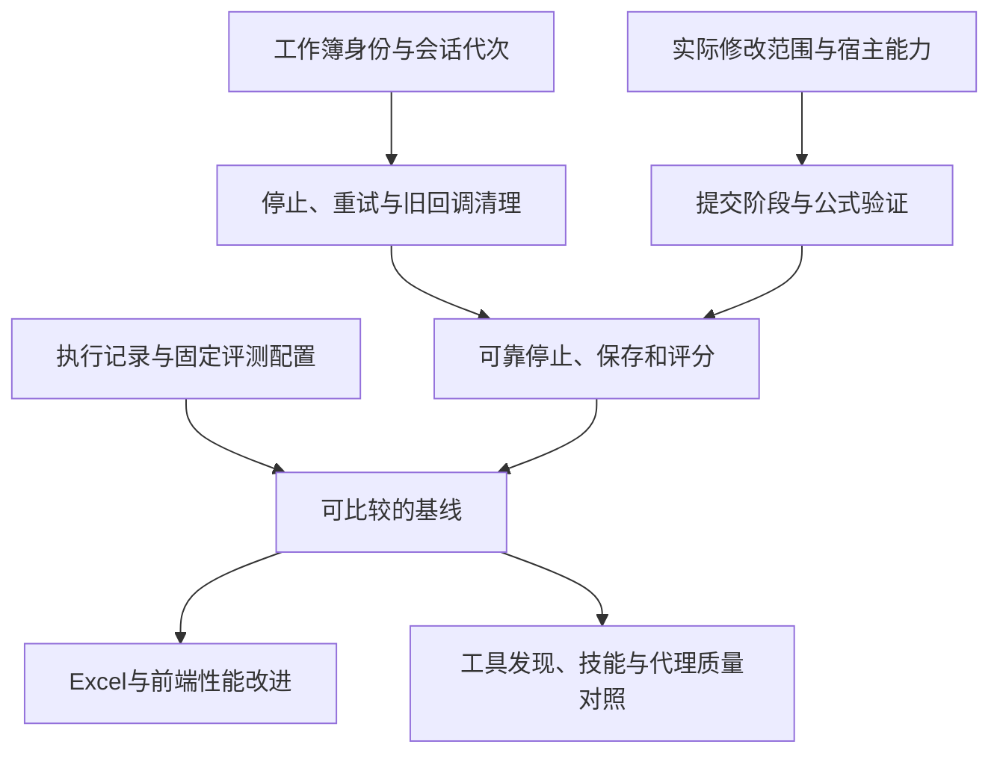

**Excel Assistant 优化分析（2026-09-18）**

范围：当前工作区代码、项目配置、现有测试、已有 SpreadsheetBench 产物，以及用户补充的开发对话文件 `claude记录`（960行）。前十七节记录分析和实施候选，第十八节起持续记录实际落地结果。本轮没有启动新的真实 Excel 评测，也没有调用模型。

版本说明：前十七节记录优化前基线的问题，代码位置以基线 `be7e92c` 为准。用户随后补充的 Claude 修复对话及 `fix/lifecycle-hangs` 工作区补丁，另见第十八节；不能把已开始修复的问题继续视为完全未处理，也不能把补丁存在视为全部验收通过。第十八节以前所述“没有调用模型、没有修改运行代码”只描述最初的 Codex 分析阶段；Claude 对话中另有真实模型探针记录。

历史补充后的定位约束：用户明确要求 **自己的自用/展示项目 + Microsoft Excel + 本地安装 + 模型开放 + 最大化组合现成实现，只写必要胶水**（记录108、158、182、231、301）。下面的模块收拢是现有代码内部的候选调整，不是要求另造代理框架、规划器、权限平台或评测平台。凡是已有能力，优先配置或修适配；确需补能力时先找可复用实现。历史第840行还明确要求把正确性、稳定性、成本、速度、体验和安装运行指标纳入评测。

证据分为三类：**已复现**表示用当前源码及隔离模拟确认了代码路径；**静态确认**表示输入、状态或校验缺口能直接从源码确认；**待实测**表示方向合理，但尚无真实 Excel 或模型对照数据。模拟结论仍需要相应的真实环境回归，特别是 Office.js 的宿主语义。

优先级：**P0** 优先修复数据、上下文、执行状态和结果可信度；**P1** 优化任务成功率、性能、成本与核心交互；**P2** 改善维护、配置和发布体验。这里的优先级表示本项目的实施顺序。

**一、先修正两点上一轮结论**

1. “只修改样式会清空原值”不成立。Office.js 写入二维数组时，`null` 表示保持对应单元格不变；之前把 mock 中的普通数组赋值当成真实宿主行为，得出了错误结论。正确语义的模拟中，样式修改后的原值 99 保持不变。真实问题是：覆盖校验扫描整个区域，会把只修改样式、或保留不变的已有单元格也拦住；`value: null` 也不表示清空，需要明确工具约定。依据：[Microsoft Learn：blank and null values](https://learn.microsoft.com/en-us/office/dev/add-ins/excel/excel-add-ins-blank-null-values)。
2. `sheet.notes` 不能简单判断为不存在。官方 NoteCollection 文档标记 ExcelApi 1.18，而项目加载的本地 Office.js 稳定类型没有该成员，manifest 只要求 1.4。应归为版本与能力检测问题，不能仅凭本地类型缺失否定宿主能力。依据：[Microsoft Learn：NoteCollection](https://learn.microsoft.com/en-us/javascript/api/excel/excel.notecollection?view=excel-js-preview)。

**二、当前基线与分析限制**

项目已连接 Electron 托盘、Node daemon、Claude Agent SDK、Excel 侧边栏、Office.js 工具、ThepExcel COM MCP 和财务技能。当前模型档位映射到 Qwen flash / plus / max。

上一轮检查：34 项单元测试通过，21 个 JS/MJS 文件语法检查通过，格式检查报告 36 个文件未通过。现有测试主要覆盖 workspace、context、session 存储、transcript 解析和桥接基础，不覆盖完整代理生命周期、真实 Office.js 操作或 COM 与侧边栏协作。

本轮读取到的正式评测记录如下。该运行名称含 verified400，但只有 6 条已记录结果，全部属于 Sheet-Level Manipulation，不能视为 400 项评测结论。

| 任务  | 比较通过 | 代理状态  | 工具调用数 | 记录耗时（秒） |
| ----- | -------- | --------- | ---------- | -------------- |
| 13-1  | 否       | timeout   | 10         | 41639.9        |
| 17-35 | 是       | completed | 5          | 47.0           |
| 22-47 | 否       | completed | 8          | 142.5          |
| 23-24 | 否       | completed | 20         | 273.8          |
| 24-23 | 是       | completed | 10         | 46.7           |
| 28-7  | 是       | completed | 5          | 57.6           |

smoke 为 1/1 通过；正式已记录样本为 3/6 通过，5 项代理正常结束，其中 2 项结果未通过比较。`completed` 只表示代理结束，不表示工作簿正确。

13-1 的 41639.9 秒约为 11.6 小时，与默认 900 秒超时明显不符。历史助手在记录820、826行将其归因于机器休眠，用户在840行明确说后来重启过电脑；本次未取得原始休眠事件证据，不能把休眠归因视为独立证实，也不能归因于模型慢。保留原失败attempt，单列环境中断/计时异常，受控重跑另记attempt；不只留下重跑通过结果，不用这一记录计算模型平均延迟。

对失败产物做只读核对后，22-47 的差异定位到 G2:G10 的 9 个值，23-24 定位到 D292/E292 的两个值。两个任务在 answer_position 外未发现相对初始文件的值或公式变化。这定位了错误范围，尚未证明错误原因，也不是对样式、对象等所有属性的完整比较。

**三、P0：会话、上下文和执行状态**

| 编号 | 证据与位置                                                          | 问题与触发                                                                                                                                          | 优化方向                                                                                                            | 验收条件                                                                                 |
| ---- | ------------------------------------------------------------------- | --------------------------------------------------------------------------------------------------------------------------------------------------- | ------------------------------------------------------------------------------------------------------------------- | ---------------------------------------------------------------------------------------- |
| R1   | 静态确认；`daemon/sessions.mjs:87`，`daemon/index.mjs:324,513,1334` | 运行中按工作簿路由，持久化按 host + cwd 保存。同一目录中的工作簿可能恢复同一 session；New chat 会删除目录共享恢复记录。                             | 会话记录绑定工作簿身份；workspace 只负责参考文件和工作目录。明确未保存、另存为、改名、移动后的身份迁移规则。        | 同目录两个工作簿并行、重连、daemon 重启后历史独立；其中一个新聊天不影响另一个。          |
| R2   | 已复现；`daemon/index.mjs:1100-1152`                                | 新 session 先写入 Map，再执行存储和提示文件初始化。初始化失败留下 settled=false 的伪运行会话；下一条消息误认为已有消费者，可能一直等待。            | 初始化成功后发布可用会话，或失败时完整清理；给当前轮明确失败状态，并允许重试。                                      | 注入存储 EACCES / 提示文件 ENOENT，界面结束等待；修复条件后下一条消息可正常执行。        |
| R3   | 已复现；`daemon/index.mjs:1149,1200,1211`                           | sawResult 属于整个常驻 loop。第一轮成功后，第二轮无 result 结束，不再进入异常结束恢复分支。                                                         | 每一轮独立记录开始、结束、错误和中断；会话存活状态与任务状态分开。                                                  | 第一轮成功、第二轮只有文本后断流，第二轮恰有一次终态；第三轮可继续。                     |
| R4   | 已复现；`daemon/index.mjs:377,496,632,1017,1288`                    | New chat 没取消待启动旧 session，清空后可能恢复旧 id；Stop 没明确取消旧消息等待者，旧消费者可能吞掉第一条重试消息；切换目录直接启动，绕过启动队列。 | 所有启动、停止、新聊天、切换模型/目录走同一生命周期模块；用代次识别旧启动、旧消费者和旧回调，取消时释放对应等待者。 | 首条消息后立即 Stop/New chat/切模型，旧会话不会复活；Stop 后第一条重试只被新消费者接收。 |
| R5   | 已复现；`daemon/sessions.mjs:45,71,95`                              | 多个调用独立 read-modify-write，同步保存两个目录时后写覆盖先写；直接写 JSON 也没有原子替换。                                                        | 在同进程串行执行完整读改写，写临时文件后替换；明确是否允许多个 daemon 同时运行，允许时需跨进程协调。                | 并发保存不同目录及工作簿的记录全部保留；中途失败保留可读取的旧状态。                     |
| R6   | 已复现；`taskpane/shared/taskpane.js:1364,1449`                     | 切换 workspace 时旧 get_context 尚未返回，强制加载仍复用旧 Promise。旧路径会填入新界面，后续保存可能写入错误 workspace。                            | 缓存和请求绑定 workspace 身份及代次；丢弃旧响应；保存时校验当前目标。                                               | 人为延迟旧目录响应再切换新目录，新目录只展示和保存自身条目。                             |
| R7   | 已复现；`taskpane/shared/taskpane.js:448,859`                       | 取消附带选区只改变 UI，没有及时同步 daemon；快速切选区后发送也可能使用旧快照。                                                                      | 发送消息时固定本轮的工作簿、选区和附带选区开关；UI 与 daemon 使用同一快照。                                         | 取消选区后本轮上下文不含旧选区；快速选区后立即发送，目标与界面一致。                     |

另有一个 **P1兼容性缺口**：历史记录583-587、609行称旧resume会话看不到新Skills，新工作区/新会话可见。当前存储只保存session id，没有有效配置版本。恢复前应核对提供方、工具/schema、插件/技能和提示等兼容性；明确哪些变更能继续resume，哪些必须新会话。不要把所有模型切换都粗暴清空聊天，也不要把历史发生的问题直接宣称在当前所有路径均复现。验收需用当前SDK分别测试工具/技能新增、提示更新、供应商切换及模型档位切换。

这些问题共同指向一个架构候选：**会话生命周期模块**。当前一个概念分散在多张 Map、启动队列、异步生成器、bridge 等待者和前端开关里，测试只覆盖部分底层存储。收拢状态转换可以让故障和修复集中，测试通过与调用者相同的接口触发真实转换。暂不设计具体函数接口，不按文件行数机械拆分。

**四、P0：工作簿修改的保护、目标和提交结果**

| 编号 | 证据与位置                                                          | 问题与触发                                                                                                                                                          | 优化方向                                                                                                                                                    | 验收条件                                                                                                |
| ---- | ------------------------------------------------------------------- | ------------------------------------------------------------------------------------------------------------------------------------------------------------------- | ----------------------------------------------------------------------------------------------------------------------------------------------------------- | ------------------------------------------------------------------------------------------------------- |
| W1   | 已复现；vendor API `:454,574,637`                                   | setCellRange 只检查初始区域，copyToRange 的目标已有数据不检查；独立 copyTo 直接复制。                                                                               | 检查整次操作的实际写入目标，包含扩展复制；只对修改值/公式的坐标判断数据覆盖，不误拦只改样式或 null 保留。用户已明确要求替换的范围应复用授权，避免重复询问。 | 初始区域空、复制目标有值/公式时有正确保护；纯格式操作保留值并可执行。                                   |
| W2   | 静态确认；vendor API `:573,577,598,885`                             | 值/样式写入已 sync 后，复制、尺寸探测或回读再失败；透视表更新先提交清空旧字段，再添加新字段。工具只返回 error，调用者不知道已有修改。Excel.run 不是整个调用的事务。 | 能提前验证的目标、字段、类型和能力都先验证；减少提交阶段；返回失败阶段和已提交范围，未知提交状态不自动重试。需要恢复时显式记录恢复能力。                    | 注入提交后错误，界面和代理知道哪些修改生效；追加、插行等不会因重试重复执行。                            |
| W3   | 静态确认；vendor API `:596`，system prompt Excel                    | formulaResults 只回读初始写入区域，不包含复制扩展；独立复制没有完整公式校验。当前验证依赖模型遵守提示。                                                             | 对实际改变范围做有界校验，特别是填充后的首尾、公式错误及关键输出；范围不大时全部检查。保留原有错误，区分本次引入的错误。                                    | 初始公式正确、扩展后出现 #REF! 等错误时能发现；不会只看起始格便宣布完成。                               |
| W4   | 静态确认；COM 的 workbook 寻址与 `daemon/index.mjs:993`             | Office.js 绑定具体 pane；COM 可使用活动工作簿或按文件名匹配。用户切换活动窗口、存在多个 Excel 实例时，两条路径的目标和保护不一致。                                  | 在 Excel 执行模块中明确工作簿 FullName、实例身份和可验证的目标；Office.js 与 COM 作为适配器，共用授权范围、写入排序和执行记录。无法确定目标时不给该能力。   | 两个工作簿、多个实例和切换活动窗口下 COM 不修改另一份文件；两种适配器针对同一工作簿的写入不会无序交错。 |
| W5   | 静态确认；`daemon/index.mjs:632`，`taskpane/shared/taskpane.js:711` | Stop 中断代理，不保证已经送到 Office.js / COM 的操作停止；60 秒 tool 超时也不代表宿主没执行。                                                                       | 定义停止状态：取消后续工作，区分已完成、正在提交和未知结果。分块操作在每块提交前检查取消；迟到结果不能归到下一轮。不能承诺取消等于撤销。                    | Stop 后不继续提交下一块；已提交修改清楚显示；未知结果先核实，不能盲目重发。                             |

恢复策略应按实际能力设计。COM snapshot restore 可能打开独立副本，不等于自动回滚原工作簿。先做到操作前检查、提交结果可追踪和局部恢复，再决定复杂操作是否需要备份。无需对所有日常操作增加确认弹窗。

这里的架构候选是 **Excel 执行模块**：Office.js 和 COM 是已有两种适配器，因此统一目标识别、策略和结果的接缝有现实用途；没有必要为了“架构完整”再增加一套通用代理框架。

**五、P1：工具输入输出约定与宿主能力**

1. **读取截断必须诚实。** vendor `getCellRanges:169` 中，一次 A1:A3 读取、cellLimit=2，只返回 A1/A2 却给 hasMore=false；公式结果为空串时计数又可能漏掉公式，cellLimit=1 实际返回更多项。已用模拟复现。优化为对返回项和负载统一计数，提供实际扫描范围、截断标记和续读位置。验收包括单区域截断、多区域、空结果公式、稀疏数据，不能把“未返回”理解为“没有数据”。
2. **输入在写入之前完整验证。** schema 中数组可为空、行可不等长、部分整数没有正数或上界；delete rows 缺 reference 能返回 success=true 却不操作，ragged cells 直接进入二维数组赋值。按 operation 明确必填项和合法范围；不合法输入不得进行宿主修改，不得返回成功。
3. **范围和工作表定位统一。** 自定义工具用 sheet 名和 A1，移植工具用稳定数值 sheetId；AutoFilter 在解析带 sheet 的地址时丢弃 sheetName。统一解析工作表限定地址、转义、稳定 ID 和大小写；不要把稳定 ID 当标签位置。验收包括带空格/引号的 sheet、多 sheet 和移动标签。
4. **错误不只是一段字符串。** 当前格式化成 MCP text、经 WS 再变回 Error 字符串，模型难以区分输入错误、目标冲突、能力缺失、超时、未执行和已部分提交。保留给模型的简洁说明，同时在内部结果里保留分类、可否重试、提交阶段和宿主错误码。
5. **能力决定工具可用性。** manifest 最低 ExcelApi 1.4，metadata 却直接读取 1.7 的 freezePanes；notes 的官方 API 为 1.18。启动时按当前宿主检测必要能力，主路径缺能力时有明确退化，选配能力不应拖垮基本读写。Node 的 engines、loadEnvFile 使用和 CI 运行版本也要一致。

建议建立 **工具定义与约定模块**，集中名称、输入校验、读写性质、宿主要求和分派映射。当前新增工具需要同时修改 daemon schema、前端 dispatcher、实现和提示；集中必要元信息能减少漂移。保留必要的模型工具说明，不把所有东西生成成不可读的大文件。移植代码修改需要可重复的补丁/构建流程，避免只改 vendor 文件后下次生成丢失修复。

**六、P1：性能优化，先测各阶段再决定收益**

端到端时间至少包含：本地会话启动、SDK/MCP/技能初始化、模型首响应、模型推理/输出、工具分派、Office.js 往返或 COM、结果回传、前端渲染与最终校验。现在只有总耗时和粗略工具数量，不能准确判断哪个阶段占大头。

| 候选              | 已观察到的代码行为                                                                                                                                 | 改进方向                                                                                                       | 测量与验收                                                                                                                                                                                           |
| ----------------- | -------------------------------------------------------------------------------------------------------------------------------------------------- | -------------------------------------------------------------------------------------------------------------- | ---------------------------------------------------------------------------------------------------------------------------------------------------------------------------------------------------- |
| 大选区读取        | `captureSelection:826` 和 selected-range 工具完整 load values，之后才判断大小；选整列/整表可能读巨大矩阵。静态确认。                               | 先取地址和规模，再按需要读少量预览；大选区采用显式分页，不把完整值作为持续选区事件载荷。                       | 单格、千格、整列和整表，记录返回字节、耗时、内存；选区追踪保持可用。                                                                                                                                 |
| Office 往返       | metadata、cell/style 读取、对象/透视字段遍历里存在逐项 sync；写 notes 逐格 sync；尺寸转换通过 XFD 整列宽度探测，多次提交。静态确认，真实时间未测。 | 批量 load，集中 sync；同质格式按区域写；避免对工作簿做不必要的测量性修改；缓存真正稳定的映射，结构变更后失效。 | 对相同工作簿记录 sync 次数、每次负载及耗时；与优化前比较结果一致，不牺牲样式准确性。                                                                                                                 |
| 读上限与负载      | cellLimit/maxRows 主要控制返回或遍历，不一定限制先从宿主完整读取的规模；search 先读全 used range。                                                 | 在宿主取数前分块；限制行列规模和序列化字节；返回截断及继续读取信息。                                           | 大 used range、有很远的格式残留、公式结果为空的数据都能有界运行。                                                                                                                                    |
| Markdown 流式渲染 | `appendAssistantDelta:334` 每个增量重新解析累计全文、净化并替换 innerHTML。                                                                        | 合并短时间内的增量，限制重绘频率，结束时一次完整渲染；保持净化及用户向上滚动行为。                             | 实际 Office WebView 中测长回复的主线程时间和掉帧。Node 仅解析微基准：100 段/6300 字符累计解析318150字符，约57ms；400段/25200字符累计解析5052600字符，约454ms。不含DOMPurify和DOM，不是产品加速幅度。 |
| 历史回放          | `transcript.mjs` 扫描项目目录找 session，读完整 jsonl 后截到最后200事件；前端逐项渲染并频繁读滚动布局。                                            | 保存可验证的 transcript 定位，缺失时才回退搜索；有界尾部读取；批量构建回放后一次滚动。                         | 大历史文件的重连耗时、内存和显示结果一致；支持坏行与路径变化。                                                                                                                                       |
| 工具目录与上下文  | 19个Office工具总是加载；COM和机器全局MCP再合并；技能可能带额外工具和提示开销。                                                                     | 基础工具保持稳定，高级工具按需求发现；COM已有bm25发现模式，可作为单变量对照；显式控制设置来源与外部MCP清单。   | 对照记录初始化耗时、实际工具列表、各类输入/缓存token、工具误用及成功率；当前未证明能节省多少。                                                                                                       |

优先处理大选区、有界读取和不必要 sync，因为它们能在本地稳定测量。模型延迟和上下文成本要通过固定任务、相同配置的对照测量；不能凭几条总耗时先换模型或大幅删工具。

**七、P1：代理任务成功率与成本**

1. **先让失败能归因。** 每次任务记录工具输入、输出/错误、目标工作簿、读写范围、提交状态和终态。不要把模型最终自述当执行日志。23-24 的最终回复提到 cell object 与 plain values 的差别，这只是输入约定误用线索，尚不能解释全部失败。
2. **验证应包含完整任务目标。** 代理结束前核对用户指定的输出区域、边界行和必要公式。22-47、23-24 的差异数量不多，说明仅报告“已完成”不能替代目标范围验证；当前不能证明具体是读取遗漏、逻辑错误还是工具误用。
3. **统一 Office 与 COM 的模型使用说明。** 明确什么时候用稳定 sheetId，什么时候用名字，COM怎样绑定已验证工作簿；缺少高级能力时给可用替代。只提供当前实际存在且可执行的示例。
4. **适配财务技能到本项目。** 部分技能已有OfficeJS分支，但要求直接执行Excel.run，当前daemon没有对应执行入口；又含openpyxl示例和逐段确认。应把真实Excel流程适配为本项目excel\_\*工具，并遵守实时工作簿保护。不能简单称它们都是离线技能。
5. **减少不必要往返。** 先获取 metadata 和适量样本确定结构，再读必要范围、批量写入、针对输出验证。允许缓存元信息，不能长期缓存用户可能修改的值；同一任务内重复读也要考虑用户并发编辑。
6. **资源预算先可见，再限制。** 记录有效token、缓存读取/写入token、调用轮数、输出规模和提供方计费信息。SDK的costUsd是否适用于第三方endpoint需要核对，不直接当账单。先观察，再按任务类型设置合理的轮数/超时预算及停止提示；已执行写入不能因为预算结束而状态不明。

**八、P0/P1：评测需要先成为可信反馈模块**

`evals/run_spreadsheetbench.py` 已搭出真实Excel闭环，但以下缺口会影响优化判断：

| 问题                      | 当前依据                                                                                       | 改进与验收                                                                                                                                                           |
| ------------------------- | ---------------------------------------------------------------------------------------------- | -------------------------------------------------------------------------------------------------------------------------------------------------------------------- |
| 结束和正确混在一起        | 5个completed中有2个比较失败                                                                    | 分别记录代理终态、保存状态、比较结果和运行环境异常。优化成功率用工作簿比较，不用completed计数。                                                                      |
| 超时计时异常              | 13-1记41639.9秒；timer为默认900秒                                                              | 记录墙钟与单调计时、阶段时间、心跳/休眠或停顿证据、计划/实际超时触发。加外层watchdog，退出后确认旧任务已停止提交，再保存/关闭，不让迟到操作串入下一任务。            |
| 正常保护和评测指令冲突    | system要求覆盖先确认；eval要求不澄清直接完成                                                   | 评测明确授权answer_position内的本次修改，并把范围约束放到执行层；正常交互复用用户明确授权。不能为了跑分全局关闭覆盖保护。                                            |
| 关键记录丢失              | daemon回costUsd/numTurns/tools；Python只保留工具数量、usage和最后2000字符                      | 保留完整受控轨迹及失败事件、工具序列、轮数；统计token和成本要标提供方来源。默认不输出密钥，正文数据可保留在本地受控产物。                                            |
| 运行不可严格复现          | 同run目录按task id跳过；未绑定配置/提示/技能/vendor版本                                        | 写manifest含代码commit及工作区内容摘要、模型实际id、非敏感配置摘要、数据集、grader、提示与工具/技能版本。配置变化产生新run，避免混合结果。                           |
| 恢复和失败重跑不明确      | results中已有id均跳过，包括失败；task目录会被清理重建                                          | 区分resume与retry-failed，保留每次attempt产物和异常，不覆盖唯一失败证据；清理前验证目标在run目录内。                                                                 |
| 比较范围受限              | 官方比较主要看指定区域缓存值，不完整检查公式、格式或范围外内容                                 | 官方分数保持原口径；另外比较初始文件与输出的授权范围外值/公式，检查必要格式、结构及重新计算状态；不能把舍入后的值相等当作动态公式正确。                              |
| 答案文件环境隔离不足      | golden不在任务目录，但模型仍有本机Read/Bash访问；cwd不是读权限限制。没有发现实际偷读答案的证据 | 评测输入与评分材料分开运行或施加真实访问限制；文件访问轨迹能够证明代理只使用题目允许的材料。只写提示词不构成隔离。                                                   |
| 采样不足                  | 正式6条全部Sheet-Level                                                                         | 建立固定覆盖集，含Cell-Level、Sheet-Level、查找、日期、文本、去重、公式、跨sheet、大数据及读写混合；单次只改一个变量。小样本报告样本量与重复波动，不外推到全数据集。 |
| 评测对现有Excel状态的干扰 | runner附着已有Excel，修改Visible和DisplayAlerts；DisplayAlerts固定恢复True，不是原值           | 专用评测实例或明确专用环境；恢复原状态，区分评测工作簿与用户工作簿。                                                                                                 |
| 已有taskpane注入不校验    | embed_taskpane发现taskpanes.xml就直接返回；新增关系采用固定id                                  | 核验既有extension是否引用本项目，关系id唯一，前后文件可正常读取；未知已有加载项不应被当作本项目已注入。                                                              |

这是 **评测与执行记录模块** 的架构候选：通过实际发生的事件收集轨迹，而非只在外层改写发送函数后拿总计。调用者和测试通过同一事件结果判断一轮完成、失败和部分提交，减少“界面看起来结束了”的假阳性。

**九、P1/P2：核心交互与运行体验**

| 优化项             | 依据                                                                                                                  | 优先级与验收                                                                                                              |
| ------------------ | --------------------------------------------------------------------------------------------------------------------- | ------------------------------------------------------------------------------------------------------------------------- |
| 中文输入法         | Enter处理没有isComposing保护；内存模拟中正在选词的Enter也触发submit。                                                 | P1；中文/日文组合输入回车不误发送，普通Enter/Shift+Enter行为正确。                                                        |
| 文件选择超时       | 前端sendRequest统一10秒；daemon picker等待5分钟。隔离模拟确认超时常量。                                               | P1；正常浏览超过10秒不丢选择结果，取消及断连可结束等待。                                                                  |
| 执行中的状态操作   | 输入框禁止第二次提交，但模型切换、New chat、Setup修改仍能改变生命周期。                                               | P1；与后台统一状态转换，解释当前动作会中止什么，旧代回调不能改变新代界面。无需为每次操作新增确认。                        |
| 可编辑下一条草稿   | 当前任务执行时整个textarea disabled。                                                                                 | P2；阻止提交即可允许编辑草稿；重连/失败不覆盖草稿，不出现双轮交错。                                                       |
| 结果面向工作簿     | UI主要显示工具名和截断参数，没有工具结果、修改范围或部分完成摘要。                                                    | P1；展示已修改sheet/range、成功/失败状态，能定位到单元格；技术参数按需展开。                                              |
| 错误面向真实提供方 | 鉴权和断流提示仍统一指向Anthropic/Claude额度，而当前使用Qwen。                                                        | P1；按错误分类和实际endpoint给恢复建议；鉴权失败与额度不足、超时分开，避免误导登录或换key。                               |
| 文档身份一致       | README/CLAUDE.md仍描述Draftspect和已删除Word文件；安装提示有过时catalog措辞。                                         | P2；当前运行方式、.env、COM/skills可选依赖和评测流程一致。                                                                |
| 启动诊断           | MCP/plugin绝对路径、uv/Claude/Office要求散落，配置错误靠日志发现。                                                    | P2；只读doctor检查运行版本、端口、配置、依赖路径和宿主能力，输出可操作失败原因；不擅自启动Excel或安装插件。               |
| 升级与面板版本一致 | 历史537行出现daemon升级后pane仍旧脚本；bridge welcome的server_version固定0.1.0，hello没有工具/构建版本检查。          | P1；握手检查协议及工具能力，缓存版本覆盖依赖模块；新daemon接旧pane时明确刷新或兼容降级，不下发不认识的工具。              |
| 本地加载诊断       | 历史385-419行出现Office.js CDN不可达、后台输出管道失效，HTML默认状态都表现成Connecting。当前本地Office.js路由已存在。 | P1/P2；分别显示页面依赖加载、Office宿主ready、HTTP、WS、SDK/模型阶段失败；保持本地静态资源方案，验收无CDN网络时仍可加载。 |

**十、维护与长期运行候选**

- **断开和空闲会话清理（P1）**：pane关闭后有live session就保留；bridge的queues没有删除路径。明确暂时断开与永久关闭的宽限期，空闲会话持久化后释放消费者及相关资源。用反复打开/关闭工作簿测Map、等待者、SDK/MCP子进程及内存；暂时断连仍须恢复正常。
- **协议隔离（P1）**：tool_result用id查pending但不校验pending.ws===当前ws。模拟中另一pane提供相同id能完成原pane请求。这是隔离缺口，不表示日常必然串数据。补所有权及轮次检查，迟到/重复响应不得完成另一轮请求。
- **桥接恢复（P1）**：固定重连间隔、缺少明确请求取消；旧连接待请求会等待原超时。先将断连请求释放，与本轮恢复统一，再按实际失联原因考虑退避。不要把普通断连当鉴权失败。
- **托盘进程生命周期（P1/P2）**：app/main.mjs的startDaemon无单次启动协调；自动重启timer没有统一取消，旧进程exit也不检查是否仍持有daemonProcess。崩溃等待重启时手动Start可能重复启动。按进程代次管理Start/Stop/Restart/Quit、spawn错误和ready超时，验收最多一个有效daemon、Quit后不被旧timer复活。
- **依赖与vendor可复现（P2）**：保留上游commit、许可证和生成脚本；维护可重放的本地修改及工具约定测试。SDK upgrades必须检查消息和选项语义；依赖锁存在不代表工作区工具/技能版本都固定。
- **回归测试接缝（P0/P1）**：现有纯逻辑测试之外，增加真实调用流程的故障注入：初始化失败、第二轮断流、Stop重试、New chat待启动、并发存储、断连迟到结果、copy目标保护、截断续读和宿主能力退化。Office.js模拟遵守官方null与sync提交语义；另保留小规模真实Excel回归，不能用模拟替代全部宿主验证。
- **暂缓大迁移**：当前架构可继续迭代。没有证据支持先重写为React、重做代理框架、引入多代理任务分工或增加大型任务编排平台。先把现有两种Excel适配器、生命周期和反馈闭环做好。

**十一、建议实施顺序与完成标准**

| 阶段                                     | 内容                                                                 | 完成标准                                                                                               |
| ---------------------------------------- | -------------------------------------------------------------------- | ------------------------------------------------------------------------------------------------------ |
| A：先保证不会串会话或失去任务状态        | R1-R7、W1-W5；保留失败终态与已提交信息；补对应故障注入回归           | 同目录/并发/Stop/重连/New chat不串；任何一轮均有明确终态；覆盖检查包含整个实际目标；未知提交不盲重试。 |
| B：建立可信基线，可与A并行做只读记录部分 | 评测manifest、轨迹、超时诊断、明确范围授权、失败产物保留；固定覆盖集 | 能区分模型逻辑失败、工具错误、环境失败、比较失败；可重放相同配置并定位阶段耗时。                       |
| C：做可测量的性能改进                    | 大选区、有界读取、批量sync、Markdown合并渲染、历史有界回放           | 相同任务结果一致；数据规模增长时负载受限；实测阶段耗时及UI响应改善。先不承诺具体加速倍数。             |
| D：提升代理完成质量及成本效率            | 工具约定、完整目标验证、财务技能适配、高级工具发现的对照             | 固定覆盖集成功率及失败类型改善；token/轮数/耗时可比较，节省成本不以准确率下降为代价。                  |
| E：降低维护与使用成本                    | 生命周期/Excel执行/工具定义/评测模块逐步收拢；doctor、配置、文档、CI | 新增工具的约定集中可检验；换机器可诊断；格式和必需回归通过，保留上游升级能力。                         |

优先级可以据固定覆盖集的真实瓶颈调整。当前没有真实阶段耗时对照，因此不预估工期、加速倍数或最终成功率。下一步应按上述完成标准逐批落地，而不是一次把所有候选实现。

**十二、第一批改动怎么拆，哪些不能拆开**

下面是供实施选择的改动范围，不是对用户增加批准步骤；当前仍只做分析。

| 批次                        | 涉及文件/模块                                       | 为什么这样拆                                                                                                                           | 首批必须验证的行为                                                                                 |
| --------------------------- | --------------------------------------------------- | -------------------------------------------------------------------------------------------------------------------------------------- | -------------------------------------------------------------------------------------------------- |
| 1. 消除可确定的挂起路径     | daemon/index.mjs及生命周期故障注入                  | 初始化失败清理、逐轮结束判断可以先小范围修复，不必等待所有架构调整。                                                                   | 初始化失败可恢复；第一轮成功后第二轮断流可结束；普通异常、SDK错误result、Stop都有可解释终态。      |
| 2. 明确会话身份和取消代次   | index、bridge、sessions、前端会话上下文             | 工作簿身份、待启动、消息等待者和旧响应属于同一行为，零散补Map容易产生新的竞态。存储格式要同时迁移；旧cwd记录不能随意认领给某个工作簿。 | 同目录多工作簿；首消息立即New chat；Stop后第一条重试；切目录旧回放；并发保存；未保存文件另存为。   |
| 3. 修正工具真实输入输出约定 | office-tools、dispatcher、Excel实现、vendor生成流程 | 输入校验、覆盖目标、分页标志和实际宿主执行必须一起改；只改工具描述不足以阻止错误执行。                                                 | ragged/空数组/缺参数写前拒绝；copy扩展保护；只改样式不误拦；读取截断可续读；旧宿主能力退化。       |
| 4. 提交结果和写入排序       | Excel执行模块、bridge工具结果、COM适配器            | 超时、停止和部分提交需要执行方与调用方共享事实，不能只在UI上改状态。                                                                   | 提交后报错不盲重试；迟到结果不串下一轮；已送达COM/Office请求明确绑定目标；手动计算及扩展公式验证。 |
| 5. 可信评测与最小观测       | daemon事件、eval runner、run manifest               | 可以先并行补记录；可靠停止/保存验收要等批次2和4的事实可用。                                                                            | 每次attempt保留配置、轨迹和产物；固定覆盖集；超时异常可定位；评分与代理终态分开。                  |

第一批不包含UI框架迁移、增加更多财务工具、换代理框架或自动切换模型。界面中文输入法和文件选择超时可作为独立小改动，不应阻塞上述关键链路。

依赖关系可概括为：

**十三、指标的口径，避免优化后看错结果**

- **端到端通过率**：通过官方比较的任务数 / 本次尝试任务数，基础设施失败也计入分母；另报任务类型和样本量。
- **基础设施完成率**：环境、pane、SDK、工具、保存及grader正常走完的任务数 / 尝试数。不能用它替代答案正确率。
- **结果正确率的条件口径**：在基础设施正常完成的任务中比较通过的比例，必须与前两项并列，不能拿来隐藏环境失败。
- **范围外保持**：按初始文件比较本次未授权修改区域；值/公式、格式、结构分开统计，声明检查范围。
- **时间**：总墙钟、活动阶段、首token、工具执行、保存/评分分别记录；超时、停顿异常单列。任务量足够后才使用P95，当前6条不做稳定尾延迟推断。
- **上下文和成本**：输入、缓存读取、缓存创建、输出token分开；工具目录和数据载荷另记字节。缓存token总量不是同等价格的未缓存token，也不是提供方账单金额。
- **重试质量**：自动重试次数、首次成功率、schema错误次数、结果未知次数及重复提交检测。减少工具数量如果增加错误，不算有效优化。
- **长期资源**：活动pane、会话、队列等待者、在途工具、SDK/MCP进程和内存，在打开/关闭及断连回归后是否回落。

以现有6条记录举例：端到端通过率为3/6；代理记录completed为5/6；completed子集通过为3/5。三种数字含义不同，不能互换。基础设施完成率仍需要更完整的trace才能严格判断，不能直接把completed当完整基础设施验收。

**十四、结合开发历史重新划定优化范围**

| 历史位置      | 用户明确要求或记录内容                                             | 本轮应如何采用                                                                                                     |
| ------------- | ------------------------------------------------------------------ | ------------------------------------------------------------------------------------------------------------------ |
| 108、158、182 | Microsoft Excel、本地、模型开放；自己的项目；自用展示              | 保持现有组合路线，重点是自己的适配、可复现验证和演示，不扩到WPS、云端或企业多租户。                                |
| 231、238、301 | A+B也有创新；少量胶水；找现成实现并核实                            | 优化前先列现成能力与实际缺口，配置优先；模块收拢只有在解决已确认故障时才做，避免整套重写。                         |
| 459           | 按原计划推进，提问不是改变方向                                     | 解释性问题不应触发反复停工确认；用户新增约束仍应合并到当前任务。                                                   |
| 556           | 当次覆盖写入是模型先询问，工具保护未真正触发                       | 演示通过不等于工具覆盖保护经过负例验收；补工具层冲突、扩展复制和明确授权测试。                                     |
| 583-587、609  | 旧会话看不到新Skills，新会话可见                                   | 配置更新与resume兼容需测试，不能只修会话key。                                                                      |
| 537、740      | 面板旧脚本、Office缓存旧加载项                                     | 把版本握手、缓存和加载诊断列为真实使用问题，不只是工程洁癖。                                                       |
| 649、653、737 | 三个Qwen模型基础tool调用；plus链路通过                             | 标为已接入/基础验证；不能扩大成所有模型、工具参数、异常语义和财务技能均通过。                                      |
| 614、934      | 原计划/建议包含“顺手改坏几格”指标                                  | 当前未落地；目标区域正确之外应保留范围外修改及公式/结构保真指标。                                                  |
| 806、840      | 曾要求正常规模评测；后来提出余额约束、可考虑Claude、先做分维度优化 | 后来的预算和优化要求修正了继续全量运行的条件。当前仅分析，不继续历史收费运行；评测规模按可承受预算和改动类型确定。 |

历史中的“关闭内置工具、不加载本机配置”（67行）是助手早期提案；后续235-236、285行又明确利用全局MCP实现少量胶水接入，用户未单独要求全部关闭。288、484-485行更具体的隔离目标，是模型环境变量及项目MCP配置不污染用户原有Claude Code。因此当前配置继承不是已经违反用户要求；应把可选全局扩展和可复现评测配置明确分开，实测不需要的工具开销。

同样，复杂前端、任意Office.js代码兜底、一键回滚和完整审批框架，是历史不同阶段的助手提案；不能全部升级为必须立刻自研的需求。需要时优先复用且核对实时工作簿约定。用户的“从能用到好用到上线”是质量维度要求，不能由此自动推导出企业化平台需求。

**十五、哪些已解决，哪些只完成了接入**

| 状态                             | 历史与当前代码对应                                                                           | 后续范围                                                                                                         |
| -------------------------------- | -------------------------------------------------------------------------------------------- | ---------------------------------------------------------------------------------------------------------------- |
| 基础接入已落地                   | 本地Office.js；Excel裁剪/品牌；marked+DOMPurify；真实模型标签；New chat；项目.env及agent配置 | 保留实现，补故障诊断和异常回归；不把它们重新列成从零开发功能。                                                   |
| 工具层已接入，验收有限           | 19个Office工具、26个COM工具；选区读取、环比公式、命名范围等历史演示                          | 验收移植输入输出语义、覆盖保护、部分提交、公式扩展、目标隔离；不以工具数量当成熟度。                             |
| 技能已可见，业务闭环未全面验收   | 六个财务技能已筛选；历史有一次审计调用证据                                                   | 分别检验审计、清洗及建模流程是否使用本项目实际工具；“可见”不是“可完成DCF/LBO”。                                  |
| 模型接口已通，多供应商体验未完善 | Qwen三档映射及plus端到端；Claude此前真实调用；提供方主要通过.env更换                         | 将“同供应商三档切换”和“多供应商切换”分开。开放能力先靠兼容接口配置；只有目标提供方需要协议转换时再评估现成路由。 |
| 评测闭环已通，多维评测未完善     | 自动pane注入、真实Excel、官方目标值评分、断点记录；smoke通过                                 | 补trace、版本manifest、尝试记录、停止收敛、误改检查、性能/成本来源；现成grader口径保留。                         |

“本地运行”应表述为本地托管、编排及工具执行，模型调用会发送所需工作簿内容。历史195行“数据不出本机”的助手表述过于绝对，不应作为展示材料中的隐私承诺。

**十六、成本与评测规模：历史建议不是已经定下的方案**

- 历史840行的5元是当时用户说明的可用余额，不是本次重新查询的账户余额，也不能理解为评测开始前的初始余额。
- 历史915行“已经花约2.5元、只剩一半”，没有账单且timeout任务usage缺失，本轮不继承这一说法。每题0.44元、全量180元等属于旧估算；兼容Anthropic协议不代表采用Anthropic缓存计费。当前单价、缓存字段与实际账单要在需要预算核算时重新查官方并验证。
- 已完成五题平均cache_read约73.73万，是多轮累计读取，不是单次上下文长度；大缓存计数不等于同量未缓存输入成本。上下文中schema、系统提示、技能、数据各占多少仍缺分解。
- 历史942-955行固定40题、先瘦身和成本节省几分之一，是助手未执行的建议，不是用户要求每次跑40题。COM bm25的约94%指初始工具目录缩减说明，不是本项目总token、延迟或费用节省。
- 全部400题适合后续同官方口径报告；开发迭代先用可承受的固定覆盖集及局部故障回归。覆盖集数量由预算与改动决定，不把每次优化都变成全量收费评测。
- 开发子集属于400题时，全量400仍与开发集重叠，不能称完全独立测试。另留不参与调参的保留集；全量报告说明重叠，保留失败与重跑记录。
- 历史允许在Qwen费用不足时考虑已接Claude，不等于当前应该立刻切换；已登录订阅也不能当成无限免费预算。先明确认证来源、实际可用额度和用量口径。

**十七、满足“最少胶水”的落地方式**

| 优化内容                 | 已有实现/来源                                                 | 本项目必要改动                                                                   |
| ------------------------ | ------------------------------------------------------------- | -------------------------------------------------------------------------------- |
| 会话挂起、停止与竞态     | Draftspect现有bridge、会话和SDK loop                          | 修初始化/终态/等待者/代次；不另造agent loop或目标合同系统。                      |
| COM目录缩减              | ThepExcel现有THEPEXCEL_MCP_TOOL_DISCOVERY=bm25                | 配置对照、核对发现及调用语义、记录实际token和误用，不自写搜索服务。              |
| 外部配置与内置工具控制   | 当前SDK的settings来源、tools/MCP配置                          | 明确Excel任务/评测配置，保留需要的Read等能力；不因瘦身破坏参考资料和Skills读取。 |
| 稀疏读写、覆盖、公式反馈 | office-agents已有API、当前移植工具                            | 修移植语义及上游缺陷，补可重放补丁/源码，保持生成流程可复现。                    |
| 高级Excel和快照          | ThepExcel现有COM工具                                          | 校验目标、解释快照恢复能力、接执行记录；缺能力再寻找其他适配实现。               |
| 财务方法                 | fin-plugins已有技能                                           | 保留专业方法，将不匹配的执行示例适配到当前工具，避免重新写整套财务知识。         |
| 评分与误改检查           | SpreadsheetBench已有grader；pi-for-excel已有误改评分思路/实现 | 核实授权范围、数据结构和许可证后复用；只补真实Excel驱动和统一报告。              |
| Markdown与界面           | marked、DOMPurify、当前原生JS                                 | 合并渲染、修IME/超时/状态一致性；不为了美化迁移完整UI框架。                      |
| 展示材料                 | 当前NOTICE、演示工作簿及评测产物                              | 展示组合来源、自己做的适配、可复现成绩和已知限制；使用脱敏配置与记录。           |

历史补充后，第一步仍是把已确认接缝故障修准，并并行补最小执行记录；随后用不调用模型的方式测目录/载荷和本地工具性能，再做小规模改前/改后模型对照。付费的对照之前要保留改前版本和固定配置，避免先改完才把新结果称作原始基线。其余候选按观测结果推进。

**十八、最新 Claude 对话与首批补丁复核（2026-09-18）**

依据：用户最新粘贴对话、当前 Git 状态、两个文件的实际 diff、现有测试，以及从当前源码抽取函数进行的隔离故障注入。本节没有启动产品 daemon、调用模型或修改运行代码；隔离验证不等于真实 SDK/Excel 回归。

**当前实际进度**

- 基线分支 `excel-assistant-base`、提交 `be7e92c` 已存在，包含34个文件的改动；此前“优化前未留版本”的问题已经处理。
- 当前分支为 `fix/lifecycle-hangs`。审查开始时只有 `daemon/index.mjs` 和 `taskpane/shared/taskpane.js` 未提交，共95行新增、30行删除。本节文档更新另计。
- 实际补丁包括：最近目录记录失败降为警告；提示词初始化失败清理；按轮设置 `turnOpen`；提供方错误文案；IME回车保护；首条消息和 New chat 等待工作目录初始化。
- Codex本轮重新执行两文件语法检查及 `npm test`，34项全部通过。测试文件没有新增，原suite没有完整daemon生命周期、DOM或IME回归，不能据此宣称新增行为均经过自动验证。

| 改动                            | 已有证据                                                                                                                                        | 当前判断                                                                                                              |
| ------------------------------- | ----------------------------------------------------------------------------------------------------------------------------------------------- | --------------------------------------------------------------------------------------------------------------------- |
| R2 初始化失败后可重试           | Claude记录中，提示文件缺失时报错，恢复文件后同一pane标识重连可回答OK                                                                            | 单次失败后恢复路径有真实daemon/模型探针证据；并发替换边界仍有缺口，见下文。                                           |
| R3 第一轮成功后第二轮断流       | 本轮从源码抽取 `startSessionForFolder`、`userMessageStream`，模拟第一轮result、第二轮输入被消费后无result结束；观察到stream_ended及一次重启安排 | 原R3触发路径的修复在隔离验证中通过。Claude对话未展示这一故障回归，仍需补可长期运行的生命周期测试及必要的SDK集成验证。 |
| hello后立即发送消息使用正确目录 | Claude最后一次探针在新目录启动了新session并回答OK                                                                                               | 该触发路径有真实探针证据；上下文读写等入口还没同步等待。                                                              |
| IME保护与提供方文案             | 实际diff包含isComposing/keyCode 229检查及通用提供方提示；语法检查通过                                                                           | 实现方向正确；尚无真实Office WebView中文输入法、鉴权失败、额度失败回归记录。                                          |
| vendor覆盖保护、截断与输入校验  | 当前生成脚本仍直接打包外部checkout                                                                                                              | 仍是下一批计划，尚未实施。                                                                                            |

**首批补丁还需要收口的边界**

1. **旧初始化失败会影响新会话，已隔离复现。** 当前 `daemon/index.mjs:1195` 的catch只对 `sessions.delete` 检查会话归属，随后 `clearUserMessages(key)` 和错误事件无条件执行。控制执行顺序为：旧会话等待提示文件 → 新会话替换同一key → 新消息入队 → 旧提示读取失败，结果新会话Map记录保留，但新消息被清空，面板仍收到旧错误。当前 `switchFolder:1342` 直接启动会话，确实存在绕过启动队列的入口。清理和用户可见事件也必须校验会话代次；初始化成功返回后的继续执行也应检查是否已被替换或取消。不要只保护Map删除。

2. **目录就绪只覆盖两个入口，已隔离复现一条遗漏。** `get_cwd_state:643`、`get_context:695`、`set_context:726` 仍直接使用 `cwdForKey`。延迟hello的目录解析，立即调用实际 `get_context` handler，得到的是默认目录；同一探针中的用户消息则会等待并使用正确目录。需要让依赖目录的入口使用一致的就绪约定，同时处理旧解析结果与显式切目录的交错。此问题原本存在，当前补丁只修了消息/New chat两个路径。

3. **等待范围包含整个历史回放，静态确认并隔离验证。** `workspaceResolving` 跟踪的 `resolvePaneWorkspace` 最后还await `sendTranscriptReplayTo`。在目录解析已经结束、回放仍等待时，首条消息仍不能安排启动。大历史文件会使目录等待附带回放耗时；实际增加多少延迟尚未测量。可以区分目录就绪与回放完成，但必须同时处理迟到回放覆盖刚发送消息的问题，不能只去掉await。

4. **R3还需覆盖“消息已接收、SDK尚未消费”的边界。** `turnOpen` 在 `userMessageStream` 消费消息时设置，未代表bridge已经接收的新任务。隔离控制为第一轮result → 第二条消息入队 → SDK输出流结束但未取第二条消息，观察到第二条留在队列，且没有失败事件或恢复安排。这个交错的真实SDK触发时机尚未验证；应纳入生命周期回归，并以已接收任务的状态判定是否仍有待处理工作，不能仅依赖输入生成器是否yield。

前两项足以说明：目前可以称“首批补丁已实现并通过部分验证”，还不能称“生命周期问题已全部修复”。原R1同目录会话共享、R4取消/等待者/旧启动、R5并发存储等也没有被这次两文件补丁解决。

**对 Claude 后续顺序的调整**

- 同意把IME和提供方文案并入首批，并保留现有架构做局部修复。先将上面的首批边界和回归补齐，再记录一个明确的修复提交，便于与 `be7e92c` 比较。
- 原计划中的“第2批会话身份和取消代次”“第4批提交结果和写入排序”仍需保留。可以与工具缺陷分批推进，但不能从“第1批→第3批→成本测量”的简表推导为已经完成或不再需要；它们影响任务目标、停止后的保存以及评测可信度。
- vendor修复应保留明确补丁、所针对的上游版本/源文件校验、匹配失败即停止构建，以及重建后的行为回归。当前脚本只把checkout HEAD写进banner，没有固定输入版本或记录未提交源码差异；“写进打包脚本”本身还不构成可复现保证。输入约定变化须同步daemon schema。
- 工具定义、提示、技能文件的字节数和本地token估计可以免费测；准确的提供方输入/缓存计费与任务质量仍需实际请求或账单，不能把静态估算称为实付成本。对话日志中的 `skills:31` 与六项技能筛选配置需要核对统计口径；本地SDK说明过滤的是主会话系统提示，不能仅凭init数量认定过滤失效或31项全部进入提示。
- “当时上游没有新提交”只能说明该次检查未获得可直接采用的修复，不能推导上游以后不会维护；当前缺陷仍可在本项目先修，后续按版本评估上游变化。

首批的最小验收集合应包括：初始化失败后恢复；旧初始化迟到失败不影响新会话；第一轮成功后第二轮断流；输入已接收但尚未被SDK消费时退出；hello后立即发消息/读写上下文；Stop/New chat/切目录与初始化交错。涉及Office宿主和真实IME的部分另做实际界面回归，源码模拟通过不代替宿主验收。

**十九、首批生命周期修复实施结果**

本节记录第十八节复核后实施的代码，当前位于 `fix/lifecycle-hangs`。实现保留现有bridge和SDK query架构，没有引入新的代理框架。

- 会话增加代次。Stop、New chat、切目录和配置重载会同步撤销待启动请求、当前query及其输入等待者；旧初始化无论迟到成功或失败，都不能再清理新队列、启动SDK或向新面板发旧错误。
- bridge的用户消息等待支持AbortSignal，并提供“是否还有已接收消息”的内部判断。第二轮已送入SDK后断流，以及消息已入队但SDK尚未消费便退出，都会得到一次明确失败终态；错误后由下一条消息按需创建新消费者，不在后台空转重启。
- 工作目录解析、显式切换、新聊天和上下文保存按pane串行。读取目录、读取上下文和保存上下文会等待目录就绪；历史回放使用独立失效标记，不再阻塞首条消息，也不能用迟到旧历史覆盖新消息。
- 初始化失败、SDK异常和异常断流都在通知界面前先退役旧会话，因此界面收到错误后立即重试也不会落入旧消费者。SDK非success result把错误原因传给界面及评测观察器，不再一律显示Ready或completed。
- Stop和目录切换不再预先创建一个空闲SDK query；下一条用户消息才启动。IME候选确认保留在输入框，鉴权和额度文案按实际模型提供方显示。

新增 `tests/lifecycle.test.mjs` 的20项回归及 `tests/taskpane.test.mjs` 的1项IME回归。它们覆盖提示文件/最近目录失败、迟到初始化、逐轮断流、未消费输入、同步立即重试、Stop、New chat、resume查找、目录解析/切换、慢回放、多pane隔离、真实WebSocket hello后立即发送、SDK error result和SDK异常。全量测试从34项增加到55项，55/55通过；四个改动代码文件通过Prettier检查，`git diff --check`无错误。

这些验证使用真实bridge和当前源码抽取的daemon生命周期，SDK query及外部I/O使用可控替身；没有调用付费模型，也没有启动Excel宿主。Claude对话中此前已有初始化失败恢复和hello立即消息的真实daemon/模型探针，但本次新增代次与取消行为仍需在实际侧边栏做一次免费手工回归。R1工作簿持久会话身份、R5会话存储并发，以及工具写入保护等后续批次尚未由本批解决。

**二十、会话记录并发与原子写入**

R5已实施：`daemon/sessions.mjs` 将每次修改的完整“读取—修改—写入”放进同一进程内的串行队列，读取会等待先前已发起的修改完成。文件先写到同目录的唯一临时文件，再通过rename替换 `sessions.json`；失败会清理临时文件，队列也能继续执行后续操作。

新增6项回归，覆盖不同目录/host并发保存、未await写入后的立即读取、touch与save交错、clear与save顺序、临时文件清理，以及一次替换失败后后续写入恢复。该修复解决当前daemon内的丢失更新，并使进程在写入中断时保留旧的完整JSON。应用仍以单daemon为运行约束：固定监听端口会阻止第二个daemon正常服务；Electron多次启动和重启代次应在后续应用生命周期批次显式收口。本批尚未改变会话按host+cwd持久化的R1身份模型。

**二十一、工具契约与 vendor 安全修复**

office-agents Excel API 的本地修复已进入可重复构建流程。`scripts/vendor-office-agents.mjs` 固定上游提交 `95fb654491a9d394dc85ea2b8c93dee2ca4546b9`，拒绝错误提交和带未提交改动的上游目录；`scripts/office-agents-patches.mjs` 对每个补丁要求源片段恰好匹配一次，匹配漂移即中止。连续两次生成的 vendor 文件 SHA-256 一致，因此这些修复不会在下次打包时静默丢失。

- `getCellRanges` 统一按实际返回的非空值或公式计数。单个范围内截断、显示为空的公式、后续空范围和后续含数据范围都会给出与实际相符的 `hasMore`；空 ranges 和非正 cellLimit 在进入 Excel.run 前拒绝。
- `setCellRange` 要求非空矩形矩阵和以 `=` 开头的公式。覆盖检查只检查真正写入值或公式的单元格；仅改样式/批注时保留原内容，稀疏矩阵中未提供 value/formula 的格也保留原值或原公式，显式 null 清空仍视为破坏性写入。`copyToRange` 在基础范围写入前检查目标，避免发现冲突时基础写入已部分提交。
- 独立 `copyTo` 增加 `allow_overwrite` 契约并在复制前检查目标；源范围与扩展目标重叠时不把源单元格误判为覆盖冲突。daemon schema、taskpane dispatcher 和生成后的浏览器 API 已同步。
- 行列结构修改在 Excel.run 前验证正整数 count、必需 reference、行号和 A:XFD 列号，避免缺参数时返回 success=true 却没有执行。表格新增行同时在 daemon schema 和 taskpane 运行时拒绝空矩阵、空行、ragged 行和负 index。
- 自定义 A1 地址解析支持带空格及转义单引号的工作表名；AutoFilter 使用地址中实际解析出的工作表，不再忽略限定的 sheetName。

本批新增工具 schema、生成补丁和 taskpane 工具回归；全量自动化测试为78/78通过，相关代码通过语法检查和Prettier检查，连续生成的 vendor 哈希一致。验证使用生成后的真实 vendor 模块与 Office.js 可控替身，没有启动真实 Excel。当前仍需保留的工具层问题包括：多次 context.sync 之间的通用部分提交语义、copyToRange 的公式结果只覆盖基础范围、宿主 API capability gating，以及更完整的结构操作边界。它们不由本批测试通过所替代。

项目直接使用 Node 的 `process.loadEnvFile`，因此 package 与 lockfile 的 engines 已从不准确的 Node 18 调整为 `>=20.12.0`，使安装约束和实际启动要求一致。

**二十二、工作簿会话身份与 workspace 解耦**

R1已实施。会话存储升级到version 3，恢复键从 `host + cwd` 改为 `host + document key`；cwd只记录该工作簿当前使用的workspace并维护最近目录。同一文件夹中的两个工作簿现在分别恢复自己的SDK session，一个工作簿执行New chat只清除自己的记录；同一工作簿显式切换workspace时继续原会话。

document key沿用bridge已经用于运行时隔离的身份：有文档地址时使用地址，没有地址时使用 `anon:<pane id>`。保存到 `sessions.json` 前会做SHA-256，云端文档URL及其查询参数不会原样落盘。v1/v2按目录保存的旧session id无法安全归属给某一个工作簿，因此迁移时保留最近目录、丢弃这些有歧义的恢复记录；第一次新会话初始化后写回version 3。

身份规则选择数据隔离优先：本地文件改名、移动或另存为后，新的文档地址在pane重新加载时视为新工作簿，不自动继承旧聊天；未保存工作簿在当前pane及WebSocket重连期间保持身份，关闭pane后不承诺恢复。当前taskpane只在启动时读取文档地址，所以同一pane内完成另存为后会继续当前内存会话，重新加载后按新地址开始。这样不会把复制出的工作簿静默绑定到原文件历史；若以后需要跨移动迁移，应增加用户可见的显式迁移操作，而不是按文件夹猜测。

新增回归覆盖同workspace双工作簿分别resume、daemon模块重载后仍独立、单工作簿New chat、workspace切换保持会话、v2安全迁移和URL不明文持久化；全量自动化测试为84/84通过。验证仍使用SDK替身；真实Excel中的改名、移动、另存为和云端URL稳定性需要宿主手工回归。

**二十三、workspace 上下文竞态与逐轮选区快照**

R6、R7已实施。Context缓存和在途读取现在绑定workspace及请求代次；切换workspace会立即使旧缓存和旧请求失效，迟到的旧响应不能覆盖新界面。保存请求携带 `expected_cwd`，daemon在串行workspace队列中再次核对目标；如果切换已发生，旧写入在接触 `CLAUDE.md` 前被拒绝。添加文件弹窗也绑定打开时的workspace，切换后不会把原目录选中的条目保存到新目录。

用户消息统一经过 `sendUserTurn`。普通输入和自动发送的preset都会在提交前直接读取一次Excel当前选区，并把这个快照原子地放进 `user_message`；bridge先合并该快照再入队。取消附带选区会立即同步 `null`，本轮消息也显式携带 `null`。如果提交时Office.js读取失败，则不复用旧选区，避免代理静默作用于错误单元格。读取期间用独立提交门阻止双击产生并发轮次。

新增6项回归，覆盖真实WebSocket逐轮选区覆盖及取消、taskpane提交时读取、读取失败、workspace旧响应丢弃和daemon旧目录写入拒绝。全量测试为90/90通过，三个运行文件通过Node语法检查，`git diff --check`通过。仓库级Prettier检查仍会列出31个既有未格式化文件；本批没有借机改写这些无关文件。以上验证没有启动Excel宿主，选区与弹窗交互仍应在实际侧边栏做一次手工回归。

**二十四、大选区与侧边栏响应优化**

- 选区标签及提交快照只读取地址、规模和首格值，保持一次sync；选整列或整表不再为标签拉取整个二维矩阵。
- `excel_get_selected_range`先读取规模，再读取最多默认2000格（参数上限5000格）的左上角预览。返回完整选区地址、总格数、预览地址及截断标志；工具描述与系统提示同步说明按需读取后续范围。这里只限制了选区工具，其他大范围读取仍待优化。
- 流式Markdown改成50毫秒合并渲染，轮次结束或断连立即刷新完整尾文；保留DOMPurify净化及向上滚动行为。
- 原生文件选择请求允许等待310秒，与daemon的5分钟窗口协调；普通请求仍为10秒。收到响应清除计时器，断连立即结束等待。

既有测试及本批已添加的大选区回归共92项全部通过，语法及差异检查通过。一次性模拟确认400个连续文本增量合并为一次完整渲染，并核对文件选择/普通请求的超时值。未做真实Office WebView耗时测量，不据此宣称实际加速倍数。

**二十五、单元格与 CSV 在宿主取数前分页**

`getCellRanges`先批量读取范围地址和规模，然后按行序生成最多2000格的读取块；单次最多扫描20000格，达到非空格返回上限时提前结束。返回 `remainingRanges` 供下一次继续；因扫描预算结束而返回 `hasMore` 时，尚未读取的部分可能为空，不宣称其中一定还有数据。保留原有公式、样式及稀疏值输出。范围列表不再固定限制50项，以允许多范围拆页产生的续读列表直接传回。

`getRangeAsCsv`先读取规模，再按 `maxRows` 和20000格双重上限加载实际数据。返回 `nextRange`；续读时使用 `includeHeaders: true`，避免每页错误跳过首行。工具schema和系统提示同步更新。改动位于可重放的vendor补丁中，已从固定上游commit重新生成产物；没有直接手改生成文件。

仅新增两项核心行为回归：3003格跨页拼接无重复或遗漏、整表空白读取达到20000格预算后停止；CSV按20000格分两页后行数及首行连续。全量94/94通过，语法和差异检查通过。真实Excel耗时与内存尚未测量；搜索工具的全used-range读取仍留待后续处理。

**二十六、搜索按扫描预算分页**

`excel_search_data` 原先无论命中多少都读取整个 used range。现在单次最多扫描 20000 格，按每块最多 2000 格读取；达到扫描预算或 `maxResults` 时返回不透明的 `nextCursor`，记录工作表、单元格位置和累计命中数。续读必须保持搜索参数不变，游标中的参数指纹不一致、工作表已删除或游标格式错误都会拒绝并要求重新搜索。某页没有命中也可能 `hasMore: true`，这只表示仍有未扫描的单元格；`totalFound` 为累计值，只有扫描结束时 `totalFoundIsExact` 才为 true。保留原有的区分大小写、整格匹配、正则和公式匹配，参数上限在进入 Excel.run 前校验。

实现放在 `scripts/office-agents-search.ts`，由补丁脚本替换固定上游提交中的 `searchData`，daemon schema、taskpane 分发和系统提示同步说明续读方式。新增 3 项回归：空白页后续扫不重读整个范围、跨页与跨工作表保持行序、四种匹配选项保持原行为。全量 97/97 通过；vendor 连续生成的 SHA-256 一致；`git diff --check` 通过。两个既有未格式化文件（`daemon/system-prompt-excel.md`、`taskpane/shared/taskpane.js`）在上一个提交时已不符合 Prettier，本批没有改写。验证仍使用 Office.js 替身，没有启动真实 Excel。

**二十七、可信评测：运行清单、状态分离与范围外修改**

- 每个运行目录固定一份 `manifest.json`：提交号、未提交差异哈希、vendor 与数据集哈希、题目列表、模型档位与超时、提示模板哈希，以及 daemon `/eval/info` 返回的 SDK 版本、提供方、档位映射、系统提示哈希、MCP/插件/技能配置。配置不一致时拒绝续跑，必须换新的 run 名。
- `/eval/run` 返回 sessionId 和轨迹文件路径（评测脚本复制为 `transcript.jsonl`），并用 5 秒心跳记录墙钟和单调时钟的最大间隔；超过 30 秒标为 `stalled`，归为基础设施失败，不算模型耗时。
- 每题分开记录：代理终态、基础设施状态（ok / no_pane / stalled / save_error / grade_error / harness_error）、官方比较结果、答案区以外被改动的格数（`evals/workbook_diff.py`，公式按文本、常量按官方口径比较）、工具调用与工具报错数、各阶段耗时。
- 汇总按第十三节口径：端到端通过率（基础设施失败留在分母）、基础设施完成率、条件通过率、范围外修改（含“通过但有误改”）、耗时中位数（样本≥20 才给 P90）、分项 token。支持 `--sample N --seed S` 按题型分层抽固定开发集，`--retry-infra` 只重跑基础设施失败的题。
- 评测结束恢复 Excel 原来的 DisplayAlerts/Visible，而不是固定设为 True。

验证：9 项离线单元测试（范围外修改、抽样、汇总口径），node 全量回归通过。标准答案文件本身的范围外差异（误报率）未做全量校准，首轮开发集结果需人工看一下样例。

**二十八、上下文瘦身：从配置入手**

用 SDK 直接发一句“只回复 OK”（qwen3.7-flash，maxTurns 1），比较首轮请求的 prompt token（输入+缓存写+缓存读）：

| 配置                                                                  | 首轮 token | 工具数 |
| --------------------------------------------------------------------- | ---------- | ------ |
| 原配置：继承全局设置与全局 MCP，默认全部内置工具                      | 62,904     | 78     |
| 只加载项目级设置，内置工具只留 Read/Glob/Grep/Skill，不挂全局 MCP     | 28,743     | 49     |
| 同上，再改为自定义系统提示（不用 claude_code 预设）                   | 27,385     | 49     |
| 去掉 COM 工具                                                         | 12,346     | 23     |
| **瘦身配置 + `ENABLE_TOOL_SEARCH`，COM 工具按需通过 ToolSearch 加载** | **13,213** | 50     |

采用最后一行：首轮上下文减少约 79%，COM 能力不丢。自定义系统提示只再省约 1.4k，不值得放弃 Claude Code 预设行为，保留预设。实现方式是 `agent.config.json` 新增 `builtinTools`、`settingSources`、`inheritUserMcpServers`、`env` 四项，缺省即为上述瘦身值；daemon 只读取配置。项目级 `CLAUDE.md`（参考文件清单）仍会加载；用户全局的 CLAUDE.md、全局技能和 `~/.claude.json` 中的 MCP 不再进入 Excel 代理。`/eval/info` 同步输出这些配置，进入评测清单。

验证：一次真实会话中，代理调用了面板工具读选区，并通过 ToolSearch 找到 `mcp__thepexcel-excel__excel_name`；node 全量测试通过。多轮任务的实际 token 与费用要在下一轮开发集评测里量，不按首轮比例外推。

补充：内置工具白名单加入 WebSearch、WebFetch。它们同样按需加载，首轮 token 基本不变（13,213 → 13,215）；在 qwen3.7-flash 下实测一次查询汇率，能返回来源网址。Bash 继续不提供：结果应以公式写入工作簿，且 Bash 可改动本地文件。

**二十九、基线中断与评测模型所有权**

首次启动 `baseline-dev40-flash` 后，笔记本合盖导致机器休眠；唤醒时taskpane重连并重发界面记住的模型，覆盖了评测指定的flash档。该运行中途停止，不作为有效基线。修复后，评测在清空历史之前先取得pane的模型所有权；评测期间的重连不能改变本轮模型，但会记住用户界面随后选择的档位。评测结束会停止临时模型会话并恢复该档位，下一条普通消息不会继续落入评测消费者。

评测配置清单不再保存 `agent.config` 中环境变量的明文，只记录键名和配置值哈希。新增1项针对本次事故的生命周期回归，并保留9项评测脚本离线测试；node全量98/98通过。当前仍没有一份完成的40题基线结果，重跑前需要使用包含本节修复的新daemon。

**三十、沙箱计算工具 `excel_bash`**

起因：开发集第 118-50 题要处理数千个单元格，代理只能逐块读进上下文再手算，既慢又容易出错。补一个本地计算环境，数据在沙箱里流转，不经过模型上下文。

| 部分             | 采用                                                 | 说明                                                                                                                                                       |
| ---------------- | ---------------------------------------------------- | ---------------------------------------------------------------------------------------------------------------------------------------------------------- |
| 沙箱 shell       | vercel-labs/just-bash 3.4.2（Apache-2.0）            | 虚拟 bash，内存文件系统，无网络，`python: true` 时带 WASM CPython；另有 awk/sed/sort/jq/sqlite3/xan。要求 Node ≥ 20.18.1，`package.json` 的 engines 已同步 |
| 工作簿与文件互转 | office-agents `sheet-to-csv` / `csv-to-sheet`（MIT） | 移植其命令语义和值类型推断，改为调用本项目已有的面板工具 `excel_get_range_as_csv`、`excel_get_cell_ranges`、`excel_set_cell_range`                         |
| 输出截断         | vercel-labs/bash-tool（MIT）                         | 每个输出流 30,000 字符上限，截断提示格式沿用                                                                                                               |
| CSV 解析         | papaparse                                            |                                                                                                                                                            |

未采用：

- pydantic/mcp-run-python：2026-01 已归档，需要 Deno，且数据要经过上下文传递。
- pi-for-excel 的 Pyodide 工具：和它的审计、恢复模块耦合，还要从 jsdelivr 下载约 15MB。
- Claude 官方 code execution：Anthropic 服务端工具，Qwen 接口不可用。
- E2B / Vercel Sandbox：不在本地运行。
- 放开内置 Bash：可以改动本地文件，第二十八节的顾虑仍然成立。`excel_bash` 碰不到本机文件，所以不冲突。

自有胶水代码：`daemon/compute-tool.mjs`，约 180 行。另在 `office-tools.mjs` 注册工具，在面板加状态文案，在 `system-prompt-excel.md` 加“Computation”一节。与上游不同之处：

- 读取按 `hasMore/nextRange` 分页。
- 写入按每块 ≤ 2,000 格分块，避免单次面板调用超过 60 秒桥接超时。
- 覆盖检查在写第一块之前扫完整个目标区域，并按 `remainingRanges` 续读，所以冲突时不会留下写了一半的数据。
- `=` 开头的值按公式写入。

使用口径：优先写公式；`excel_bash` 用于分析、核对和一次性数据变换。写回的静态值须在回答中说明。`--force` 服从覆盖保护规则。沙箱文件在会话内保留，daemon 重启后丢失。

验证：

- 离线模拟：Python 能运行；5,000 行分三页导出；覆盖检查能拒绝写入；1,500×3 分三块写入，公式透传；无网络，无主机文件；截断生效。
- 真实会话：qwen3.7-flash，模拟面板提供 3,000 行订单表。代理先预览 20 行，随后改用 `excel_bash` 整表导出并用 Python 统计，两项答案与真值完全一致：119 位客户下单超过 10 次，最高为 C087，合计 5,128.93。
- node 全量测试 98/98 通过。
- 真实 Excel 中的 `csv-to-sheet` 写入尚未验证，留给下一轮开发集评测。

**三十一、真实任务失败链修复**

针对 `baseline-dev40-flash-3` 暴露的高错误率，本轮修复了基础设施以外的主要执行问题：

- `excel_set_cell_range` 在校验前统一处理二维矩阵、一维行/列、单个值、单元格对象及 JSON 字符串。单个公式配合较大目标范围时自动转成“写入首格并复制到目标范围”，保留 Excel 的相对引用转换。
- 覆盖授权改为按用户请求范围判断。用户明确要求修改、填充、修复、排序或替换的目标区域可直接使用 `allow_overwrite=true`/`--force`；请求范围外的已有数据仍需确认。
- 普通单元格任务禁止退回到不可用的 VBA 或 Python in Excel；COM 仍保留给 Power Query、数据模型、页面设置等 Office.js 未覆盖能力。无效工作表 ID 的错误会附上当前工作簿的有效名称与 ID。
- `excel_bash` 的单次执行上限从 120 秒降到 45 秒，并接入会话取消信号。工作簿调用转发同一信号；分块写入会报告已提交范围，避免超时后静默继续。
- 桥接工具结果绑定原始 WebSocket 和 pane key。Stop、会话替换或超时时向面板发送取消消息；超时/断线统一返回 `commitStatus: unknown`，代理必须先重读再重试。
- Office.js 写入在 `context.sync` 后读回最终目标范围，返回 `commitStatus`、`writtenRange`、`cellsCommitted`、`formulaResults` 和 `formulaErrors`。复制填充后的每个公式结果都纳入检查。
- 评测提示明确答案区覆盖授权；结果把参数校验、覆盖拦截、旧工作表 ID、工具名、沙箱环境和超时错误分组，并把基础设施、工具恢复、代理/基准差异分开报告。

验证集中在实现完成后执行：Node 101/101、评测脚本 10/10，通过语法检查和 `git diff --check`。真实 Excel 集成检查在已有数据 `B2:B4` 上写入 `=A2*2` 并复制填充，返回 `committed`，读回公式为 `=A2*2`、`=A3*2`、`=A4*2`，计算值为 20、40、60。完整 40 题基线尚未重跑。

**三十二、评测提示复原、参数只收不猜、移植 Pi 的起始上下文**

评测提示：d14d8a0 改写了 `answer_position` 一句，而这句是 SpreadsheetBench 官方原文（`_sdks/spreadsheetbench/inference/prompt_format.py`）。改写后成绩无法与公开结果对比，也等于按单题调评测。这项改动也没有必要：官方只给答案区评分，118-50 的 A 列排序不影响通过与否；范围外修改已由第二十七节之后加入的标准答案校准排除。现已复原为官方原文，加上 0e35e9a 的一句 Excel 适配说明（答案区内允许覆盖）。

参数兼容：以下几种可以无歧义判断，继续接受：

- 二维矩阵、单个值，以及可解析的 JSON 字符串；
- 一维列表：目标只有一列时按列，否则按行；
- 普通字符串按 `=` 开头判断是否为公式（沿用 pi-for-excel `write_cells` 的约定）。

以下猜测会把数据静默写错位置，已删除：

- 用正则从损坏的 JSON 中捞公式（普通值会被丢掉，后面的单元格随之错位）；
- 在多行多列范围上把 N×1 转成 1×N；
- 按行优先把一维列表重排成矩阵，现在改为报错并要求传入二维数组；
- 普通值比目标范围小时重复平铺。现在只有公式图案会平铺，普通值只写在左上角。

新增一项检查：矩阵若超出多格目标范围就报错，不再交给面板按矩阵自动扩展范围。183-8 复测中曾出现 3×1 公式写向 J3:L3、实际落在 J3:J5 的情况。

起始上下文，移植 pi-for-excel（MIT，锁定 fd6c9e3，clone 到 `_sdks/pi-for-excel`）：

| 部分                                       | 来源                                                | 处理                                                                                                                    |
| ------------------------------------------ | --------------------------------------------------- | ----------------------------------------------------------------------------------------------------------------------- |
| 工作簿概览：表、表头、表格、对象、命名区域 | `tools/get-workbook-overview.ts` 的 `buildOverview` | 打包并限制表头读取、只取形状数量；构建时用空对象代替工具定义用的 typebox                                                |
| 选区及上下 5 行、选中公式、附近错误        | `context/selection.ts`                              | 打包，并修补读取范围：选区最多读 20 行，窗口不超过约 30×20 格，列窗口跟随第 20 列以后的选区（上游选中整列会读入百万格） |
| 最近发生修改的单元格                       | `context/change-tracker.ts`                         | 打包并修正归因文案；不再在轮次结束时清空，避免丢失代理执行期间的用户编辑。记录也可能包含代理写入，不能据此判断编辑者    |
| sheetId 对照                               | 现有 office-agents `getWorkbookMetadata`            | 放在概览前，即使概览超时也可提供                                                                                        |

未采用：

- `context-injection.ts`：依赖 pi-agent-core 的消息变换；
- 概览缓存与失效机制：需要它的工具事件。改为每轮重建，面板侧 2.5 秒超时。

胶水代码：

- `scripts/vendor-pi-context.mjs` 和 `pi-context-patches.mjs`：与 office-agents 相同的锁定 commit、干净检出、唯一匹配补丁；
- 面板工具 `excel_context_snapshot`；
- daemon 在每轮开始前拉取上下文（4 秒超时，失败则跳过），概览只在会话内发生变化时注入；
- 系统提示一段说明。

验证：

- Node 105/105、评测脚本测试通过；
- 真实 Excel 复测两题，首条消息都带有 `[Auto-context]`，183-8 附近的三个 `#DIV/0!` 也列了出来；
- 16511：工具调用从 13 次降到 6 次，输入 token 约减半，不再单独调用 metadata；
- 183-8：仍未通过。新增的错误多为 Qwen flash 生成了无法解析的工具参数，另有一次矩阵方向写反，后者已由上面的越界检查拦截。

两题样本不能说明通过率变化，需要用固定小样本评估。

**三十三、自动上下文的一致性与上限收尾**

- 面板读取附近单元格时使用消息提交时捕获的工作表和地址；用户在提交后切换选区，不会把另一片区域注入同一轮。无法解析或已不存在的地址会跳过选区上下文。
- 选区单格预览截到 160 字，公式与错误列表各最多列 20 项；注入的概览、工作表 ID 对照、选区和修改记录分别有字符上限，截断时提示模型再用工具读取。
- 工作簿概览只读取前 20 列表头，并按形状数量查询而非加载所有形状对象；若目标表头位于更远的列，代理需用读取工具查看。
- 概览读取只允许一个未完成的 Office.js 请求；超过面板等待上限的底层请求无法取消，但下一轮会复用它，不会叠加更多读取。
- 修改记录不再在代理轮次结束时丢弃；文案改为“工作簿修改，可能包含代理写入”，避免把没有来源信息的事件误报为用户编辑。
- Pi 打包脚本同时复制完整 MIT 许可文本，新增 `npm run vendor:pi-context` 作为重建入口。
- 补充：修改记录按 Excel 事件的 `triggerSource`（ExcelApi 1.14）跳过 `ThisLocalAddin`，即本加载项经 Office.js 的写入，包括所有面板写工具和 `csv-to-sheet`。用户在代理执行期间的手动修改仍会保留。COM 写入和不支持该字段的旧版 Excel 仍会出现在记录中，所以上面“可能包含代理写入”的文案保留不变。真实 Excel 验证：代理经面板写入 B2 未出现在下一轮记录中，经 COM 手动改的 D5 被列出。node 109/109。

**三十四、跑小样本前的代码审查（0e35e9a–efda843）**

逐文件审查了 Codex 的三次提交，以及上一次的上下文移植。修正了以下问题：

- `cells` 参数说明原文为 “or a JSON string containing one of those forms”，等于鼓励模型把数组包成字符串，而 Qwen flash 不会转义公式里的引号。fix-chain-flash-7 的 18 次工具错误里有 7 次出自这里。说明已改为明确要求 JSON 数组、不要字符串；合法的字符串仍可解析。
- 写入回执会回读整个目标区域。按提示推荐的 `excel_fill_formula` 填 F2:F5000，会返回约 5000 个公式值，超过 SDK 工具输出上限，模型只能看到“结果过大，已存文件”。daemon 现在只保留前 20 个结果和前 50 个错误，并附上总数。
- `csv-to-sheet` 原先遇到公式错误就在当前块停下，留下写了一半的表；而 `#N/A` 这类错误常常是预期内的。现在写完全部分块，最后再列出错误。
- `daemon/bridge.mjs` 第 21 行的分隔符是一个原始 NUL 字节，从 Draftspect 初版就在。它让 git 把整个文件当二进制，diff 和 PR 里都看不到改动。改成等价的 Unicode 转义，运行时的值不变。
- 评测错误分类：新增“模型生成的 JSON 无法解析”“矩阵形状不符”两类。覆盖拦截是授权覆盖的正常第一步，不再让失败题被归为“工具或恢复”。

确认没有问题的：

- 桥接的结果归属检查：所有调用都带有 pane key。
- just-bash 会把取消信号传给自定义命令，所以超时后分块写入会停止。
- `/eval/tool` 与其他评测端点一样校验 token。
- VBA 和 Python in Excel 的拒绝逻辑。

node 111/111，评测脚本测试通过。

**三十五、10 题样本与随后的修复**

`sample10-flash-394778d` 跑到第 5 题 1818 时，模型写出整列数组公式（`MATCH(1,(Data!$C:$C=…)*(COUNTIF($B$2:B2,Data!$A:$A)=1),0)`），并向下填了 66 行。Excel 重算超过一小时，此后 6 题全部因 COM 失败而无效。为此做了两处修复：系统提示禁止在数组运算中引用整列，改用实际数据区域；评测脚本在每题开始前等待 Excel 恢复，并关闭上一题残留的工作簿，10 分钟仍无响应则停止整轮评测，不再把剩余题目空跑掉。

`sample10-flash-r2`（同样 10 题）：

- 通过 4/10，基础设施 10/10 正常；
- 平均每题 10.5 次工具调用，耗时中位数 76 秒；
- 能核查的 7 题没有答案区外误改；
- 1818 没有再卡住 Excel。

失败的 6 题基本都是模型问题：

- 118-50 理解错题意；
- 183-8 公式逻辑错误；
- 1818 没写公式，直接填了手算的值，并错了一行；
- 170-13、208-20 的数据行数不对，越界检查已拦住；
- 32093 题意本身有歧义。

18 次工具错误中，最多的是工具名漏写 `mcp__office__` 前缀，共 8 次。

随后修复（未再评测）：

- 提示词和工具说明统一使用完整工具名。原先整篇都写不带前缀的名字，只靠一句话说明前缀，模型照抄了不带前缀的写法。
- `excel_bash` 说明中注明沙箱命令只能在 shell 中运行，不能从 Python 的 subprocess 调用。
- 公式写入被 Excel 以 `InvalidArgument` 拒绝时，附上常见语法错误提示，例如用了 `!=` 而不是 `<>`。Pi 的 `validateFormula` 只检查引号和括号，发现不了这类错误，所以未采用。
- 其余 10 个写工具成功后统一返回 `commitStatus: "committed"`（Excel.run 已同步即已提交），提示词中不再需要特例说明。
- manifest 的 ExcelApi 最低版本从 1.4 提到 1.9。本地 Office.js 运行时的版本检查显示，`Range.copyFrom` 和 `Worksheet.shapes` 都需要 1.9。
- 许可证：office-agents 上游只在 README 和 package.json 声明 MIT，没有 LICENSE 文件，因此在 vendor 目录补上 MIT 文本；NOTICE 补充了 pi-for-excel、just-bash、PapaParse 和 SpreadsheetBench（CC BY-SA 4.0，仅用于评测）。
- 金融技能按“Office JS 环境”编写，而本项目没有执行原始 Office.js 的工具。提示词说明了如何改用对应工具，并忽略技能中的 openpyxl 和 recalc 步骤。

node 112/112，评测脚本测试通过。

**三十六、写入回执和单元格范围授权收口**

- 所有 Office.js 修改工具统一返回 `commitStatus`、`receiptId`、`operation`、`affectedTargets` 和 `verification`。单元格写入、公式填充和复制标为 `read_back`；其余修改只标为 `commit_acknowledged`，不会把 Excel 接受操作说成题意已经正确。
- 面板错误改为结构化传递。桥接保留 `code` 和 `commitStatus`；写操作在派发后发生错误但无法确认状态时返回 `unknown`，代理必须先重读，不能直接重试。
- daemon 从每轮消息的提交时选区、SpreadsheetBench 的 `answer_position` 和带修改语义的明确 A1 目标提取授权范围，同时绑定工作表 ID。覆盖写入、覆盖复制、清空、格式、排序和行列尺寸修改若超出范围，会在调用 Excel 前以 `MUTATION_SCOPE_REQUIRED/not_committed` 拒绝。
- 公式中的引用和带“根据/来自/from/using”等来源标记的范围不作为修改授权；矩阵从单个起点自动扩展时，按实际扩展区域检查。
- 此约束暂不覆盖工作表增删改名、行列结构、图表/透视表和外部 COM 工具。这些目标不是统一的矩形单元格范围，需要按操作类型建立授权语义，不能假装已由 A1 范围解决。

**三十七、自动恢复点接入**

- 复用 pi-for-excel 的 `WorkbookRecoveryLog`、格式快照和恢复实现；本项目只维护 Office.js 工作表定位、本地存储和工具回执适配。
- 单元格写入、清空、复制、格式、排序和行列尺寸修改会在执行前捕获必要状态，成功后把恢复点 ID 放进统一回执。恢复操作会再生成反向恢复点，因此可以撤销一次恢复。
- 新增 `excel_workbook_history`，支持当前工作簿的恢复点列表、恢复、删除和清空。恢复点按工作簿哈希隔离，本地保存，不持久化原始文件路径。
- 表格、筛选、工作表结构、图表/透视表和批注暂时返回 `recovery.status: "not_available"`。没有为这些对象堆叠不完整的通用快照；后续只在实现对应结构状态时扩展。

**三十八、撤销按消息文本推断的修改范围限制**

第三十六节的范围限制只从三个来源确定本轮可以改哪里：提交消息时的选区、评测提示里的 `### answer_position`、用正则在消息中动词附近找到的 A1 地址。实测 7 个常见请求全部被拒：

- B 列统一改日期格式；
- 表头加粗；
- 按日期排序；
- 某列空白填 0；
- 第二轮回复“好的，覆盖吧”（句中没有地址）；
- 明确写了 C2:C20 的“改成保留两位小数”（“改成”不在它的动词表里）；
- 评测题 118-50 要求的 A 列排序。

也就是说，除非用户事先精确选中目标，日常的覆盖、格式、排序、清除都做不了。它还有三个问题：

- 靠正则猜测用户意图；
- 把评测专用格式写进了产品代码；
- COM 工具不受它约束，只挡住了部分路径。

公开方案的做法也不是这样：Pi 用恢复点兜底；MS-Excel-AI-plugin 和 ExcelLLMAddin 先预览、由用户批准再执行。

已删除 `daemon/mutation-scope.mjs` 及其接线、测试和提示词段落。保留原有的覆盖保护、统一回执和第三十七节的恢复点。若需要更严格的控制，改为借鉴上述两个项目，做一个可开关的“先预览、再批准”模式。恢复点存储键名由 `draftspect-recovery` 改为 `excel-assistant-recovery`，产品名仍为 Excel Assistant。CLAUDE.md 按本项目实际情况重写：原文是 Draftspect 上游的说明，产品名、Word 支持、MCP 转发和登录方式都已不适用。

**三十九、恢复点的真实 Excel 验证与两处修复**

通过 `/eval/tool` 直接调用任务窗格工具，不经过模型，在真实 Excel 中依次执行四步写入：

- 覆盖写入 B2:B3；
- 取消表头加粗并改填充色（表头原本只有 A1 加粗、C1 有填充）；
- 按名称排序 A2:C5；
- 全部清空 C2:C5（含公式和格式）。

然后从最后一步开始倒序逐个恢复，逐项比对值、公式、加粗和填充色。首轮暴露两个问题，mock 测试都没有发现：

- **表头改格式没有建成恢复点。** Pi 的格式捕获按区域记录一个状态，区域内格式不一致（比如 A1 加粗、B1 不加粗）就放弃。另外，恢复前 Pi 会先按同一地址捕获当前状态作为反向恢复点，这一步也会因格式不一致失败，导致排序的恢复中止。修复：`recovery.js` 对 500 格以内的区域一律逐个单元格捕获（地址写作 `'Sheet1'!A1,B1,C1`，Pi 原本就支持多区域地址），恢复点保存的也是逐格地址。
- **恢复“无填充”时报 InvalidArgument。** Windows 版 Excel 把无填充的颜色读成 `""`，写回 `""` 会被拒绝。修复：在 vendor 构建中给 Pi 的 `applyFormatRangeStateToArea` 打补丁，遇到 `""` 时调用 `fill.clear()`（`scripts/pi-context-patches.mjs`，要求恰好匹配一处）。这是上游问题，可以反馈给 Pi。

定位时发现，任务窗格回传的错误只有本地化后的文字。现在会附上 Office.js 的 `debugInfo.errorLocation`（例如 `[at RangeFill.color]`），模型看到报错时也能知道是哪个接口拒绝了。

修复后结果：

- 四步都建成了恢复点；
- 倒序全部恢复后，与原始状态完全一致；
- 对最后一次恢复生成的反向恢复点再做恢复，B2:B3 回到 40 和 20，重做可用。

node 114/114。

**四十、移植 Pi 的公式解释与依赖追踪**

新增两个只读工具：`excel_explain_formula`（用自然语言解释公式，并列出直接引用及其当前值）和 `excel_trace_dependencies`（上游或下游依赖树，最深 5 层）。实现直接复用 pi-for-excel 的工具对象（`createExplainFormulaTool`、`createTraceDependenciesTool`），随 `pi-context.js` 一起打包。任务窗格调用它们的执行函数，把输出文本作为结果返回；daemon 这边的参数定义与 Pi 一致。

真实 Excel 验证：A1:A3 → B1 `=SUM(A1:A3)` → C1 `=B1*2` → Sheet2!A1 `=Sheet1!C1+1`。解释、跨表的下游追踪、静态值识别都正确。

发现并修复一个上游问题：Excel 的 `getDirectPrecedents` / `getDirectDependents` 以区域形式返回（如 `Sheet1!A1:A3`），Pi 只保留了每个区域的左上角，导致 `SUM(A1:A3)` 只追踪到 A1，会让模型误以为 A2、A3 不影响结果。构建时打补丁，把区域展开为逐个单元格，受 Pi 原有的每节点 80 个上限约束；整列引用仍按 Pi 原来的方式处理（`patchTraceDependencies`，要求恰好匹配）。修复后上游树正确列出 A1、A2、A3。

node 114/114。

**四十一、工作表结构的恢复点**

复用 pi-for-excel 的结构快照（`modify_structure_state`），在 `recovery.js` 中把我们的结构工具换算成 Pi 的状态，另外导出 Pi 的 `captureModifyStructureState`、`captureValueDataRange`、`captureSheetValueDataRange`：

- 插入行或列、新建工作表：修改后记录位置或新表 ID，恢复时删除；
- 删除行或列、删除工作表：修改前捕获被删的数据，恢复时重新插入并写回；
- 重命名工作表：修改前捕获原名。

真实 Excel 验证，依次执行六步：插入两行、删除 B 列（C 列公式引用 B 列）、改名、新建表、删除有数据的表、复制表。首轮暴露两个问题，已修复：

- **删除列后恢复，C 列公式仍是 `#REF!`。** Excel 删除行列时会立刻把引用它们的公式改成 `#REF!`，Pi 只补回被删区域的数据。修复：删除行列前，额外保存该表已用区域的值和公式（在 2 万格上限内），放进同一组；恢复时先插回行列，再写回值和公式，并对同组快照显式排序，结构快照优先。修复后 Sheet1 的值和公式与原始状态完全一致。
- **复制工作表的恢复点必然失败。** Pi 为了安全，拒绝删除有数据的表，而副本一定有数据。改为不建恢复点，并在回执里说明撤销方法：删除副本，删除操作本身会建恢复点。

仍然存在的限制：

- 工作表删除后又恢复，会得到新的表 ID，此前针对这张表的改名恢复点因此失效；
- 其他工作表里引用了被删行列或被删表的公式，恢复后仍是 `#REF!`；
- 隐藏行列、冻结窗格没有恢复点，这类操作可以直接反向执行；
- 表格、图表、批注和 COM 写入仍没有恢复点。

node 114/114。

**四十二、可选的“写入前审批”模式**

借鉴 MS-Excel-AI-plugin 的变更集和 ExcelLLMAddin 的“先批准再执行”，默认关闭，在设置页的 Preferences 中开启（Ask before changing the workbook）。

实现方式与两者不同：两者都是先排队、事后统一执行，这样模型在同一轮里看不到真实的写入结果。这里改用 Agent SDK 的 `canUseTool` 钩子，每次写入前暂停，在面板中弹出卡片，列出目标工作表、区域、操作和单元格样例，提供三个选项：批准、本轮全部批准、拒绝。这和 Claude Code 自身的权限提示是同一机制，模型每一步拿到的都是真实结果。

需要审批的操作：

- 所有写入类面板工具；
- `excel_workbook_history` 的恢复、删除和清空；
- 包含 `csv-to-sheet` 的 `excel_bash` 命令；
- 全部 COM 工具。

拒绝时会告诉模型不要重试，改为询问用户。等待期间按停止或等待超过 10 分钟，都按拒绝处理。评测运行时自动跳过审批：设置保存在 localStorage，由所有工作簿共用，不跳过的话评测会卡在等待审批上。

用真实模型验证（qwen3.7-flash，模拟面板）：

- 第一次批准后 E1 写入；第二次拒绝后，写入请求没有到达面板，模型也如实报告并询问用户；
- 选择“本轮全部批准”后，三次写入只出现一次审批。

面板卡片的界面还没有在真实 Excel 中实际点击验证。node 114/114。

**四十三、历史、恢复界面和结果展示的后续实现**

- `e215511`：按工作簿隔离的会话历史，支持查看、续接和删除。
- `f6aed34`：恢复点列表、搜索筛选、删除和恢复界面。
- `07acbc4`：写入卡片展示回执、目标、验证等级、公式错误和恢复入口；尚无修改前后 diff。
- `f7e173a`：执行期间排队后续指令，保存提交时选区；展示 SDK 压缩事件，尚无项目级溢出重试。
- `bb17265`：同一窗格内 Office.js 写入与恢复排队，返回 revision；没有统一 COM 或跨窗格写入。
- `36dc014`：Provider 和最近一轮主代理 Token 展示，以及配置指纹和不兼容历史的只读查看；尚无 Provider 编辑、费用统计和完整配置内容指纹。

上述版本最终代码测试为 129/129。不能据这些提交把用户的十二项优先任务全部标为完成，当前状态统一记录在 `docs/priority-roadmap.md`。

**四十四、P0：可执行的任务结果检查**

新增只读 `excel_verify_task`：写前声明检查条件，写后运行；正常轮次结束时 daemon 自动重查已有计划。支持非空行数、行唯一性、必填值、独立预期矩阵、来源成员、来源行多重集合、公式覆盖及数值合计。条件来自用户要求和原始输入，不从自然语言正则推断，也不自动撤销写入。

- 来源约束在声明时保存输入快照，原地排序或筛选后仍能检查原始来源；行比较保留列之间的对应关系和重复次数。
- 复用现有 `getCellRanges` 分页，直到完整读取。总范围上限 20 万格；读取失败或游标不完整返回 `incomplete`，不视为通过。
- 检查计划每轮重置。没有计划的修改轮次显示 `not_checked`；已通过但随后又修改的结果在结束时重新读取，不沿用旧结论。
- 任务窗格显示通过数、失败条件及最多五个失败例子。SDK 执行状态和条件检查状态分别记录到评测响应，不把 SDK success 改写成题目通过。
- 只验证声明的约束，不能证明模型理解完整，也没有跨 Office.js/COM 的原子读取保证。统一执行协调仍是下一个 P0。

复用/候选取舍和胶水说明见 `docs/task-verification-design.md`。新增六个关键回归覆盖原地来源快照、完整分页、错值/残留/重复、公式与汇总、后续写入失效和实际轮次接线；代码测试 135/135 通过。未启动新的 SpreadsheetBench 全量评测，真实 Excel 交互与任务效果尚待验收。

**四十三、10 题样本复跑（af6530b）**

与上一轮同一组 10 题，同为 qwen3.7-flash，基础设施 10/10 正常，通过 5/10（上一轮 4/10）。但有 7 题结果翻转：170-13、183-8、208-20、32093 由失败转通过，177-6、267-21、32902 由通过转失败。183-8、208-20、32093 是首次通过。

结论：这组数据不能用来证明改进。小模型加 10 题样本的波动，大于两轮之间 1 题的差值。要判断效果，需要同一配置重复多次取平均，或换更强的模型、扩大样本。

其他指标：平均每题 14.2 次工具调用，耗时中位数 90.5 秒；能核查的 7 题没有答案区外误改。22 次工具报错中，8 次是覆盖保护拦截（正常流程），3 次是数据形状不符被拦，其余为沙箱误用和模型参数问题。

**四十五、P0：统一工作簿协调与 revision**

把协调所有权移到 daemon，以规范化后的工作簿路径为键，让 Office.js、恢复界面和 ThepExcel COM 工具共用一条串行队列。Pi 的 coordinator 负责 FIFO 排队；项目自己的适配层让读取也等待在先操作，并在写入开始时推进 revision，因此可能部分提交的失败写入不会继续沿用旧版本。

- 每个会话记录最近一次协调工具返回的 revision。若另一会话先写入，旧会话下一次写入会在派发前收到 `STALE_WORKBOOK_REVISION`，需要重新读取。
- daemon 只启动一个 ThepExcel MCP 进程，并将其 26 个原始 schema 动态代理回每个 Excel 会话。每次调用强制使用任务窗格当前工作簿名；写入前读取 `excel_workbook info`，FullName 与任务窗格路径不同就拒绝。
- Stop 或 60 秒调用超时只结束调用者等待；任务窗格会在 Office.js handler 实际结束后发送 `tool_settled`，共享队列此前不会放行。若连接中断或 COM 超时导致结果未知，后续写入被锁住；工具卡提供“已检查工作簿，继续”入口，解除时再次推进 revision。
- 恢复点列表、删除、清空及恢复不再绕过 daemon。恢复仍由任务窗格执行现有快照逻辑，但调度与普通工具调用使用同一队列。
- COM 的打开、新建、另存为、关闭和快照恢复会改变任务窗格的工作簿边界，协调代理明确拒绝；这类操作需要先设计跨工作簿身份迁移，不能假装仍在原工作簿 revision 中。

边界：revision 不观察用户手工编辑、外部程序、Excel 后台刷新或另一个 daemon；COM 只支持有本地路径的活动工作簿。实现与边界详见 `docs/workbook-coordination-design.md`。动态代理已连接真实 ThepExcel server 并加载 26 个工具；代码测试 137/137 通过，尚未做 Excel 打开状态下的 Office.js/COM 交错验收。
